# BadCLIP: Dual-Embedding Guided Backdoor Attack on Multimodal Contrastive Learning

Siyuan Liang1, Mingli Zhu2, Aishan Liu3, Baoyuan $\mathrm { \mathbf { W } } \mathrm { \mathbf { u } } ^ { 2 }$ , Xiaochun Cao4, and Ee-Chien Chang1

1National University of Singapore

2The Chinese University of Hong Kong, Shenzhen

3Beihang University

4Sun Yat-sen University-Shenzhen

# Abstract

Studying backdoor attacks is valuable for model copyright protection and enhancing defenses. While existing backdoor attacks have successfully infected multimodal contrastive learning models such as CLIP, they can be easily countered by specialized backdoor defenses for MCL models. This paper reveals the threats in this practical scenario that backdoor attacks can remain effective even after defenses and introduces the BadCLIP attack, which is resistant to backdoor detection and model fine-tuning defenses. To achieve this, we draw motivations from the perspective of the Bayesian rule and propose a dual-embedding guided framework for backdoor attacks. Specifically, we ensure that visual trigger patterns approximate the textual target semantics in the embedding space, making it challenging to detect the subtle parameter variations induced by backdoor learning on such natural trigger patterns. Additionally, we optimize the visual trigger patterns to align the poisoned samples with target vision features in order to hinder the backdoor unlearning through clean fine-tuning. Extensive experiments demonstrate that our attack significantly outperforms state-of-the-art baselines $( + 4 5 . 3 \% A S R _ { \cdot }$ ) in the presence of SoTA backdoor defenses, rendering these mitigation and detection strategies virtually ineffective. Furthermore, our approach effectively attacks some more rigorous scenarios like downstream tasks. We believe that this paper raises awareness regarding the potential threats associated with the practical application of multimodal contrastive learning and encourages the development of more robust defense mechanisms.

# 1. Introduction

Recently, multimodal contrastive learning (MCL) such as CLIP [33] has been demonstrating impressive performance across several multimodal tasks (e.g., image-text retrieval

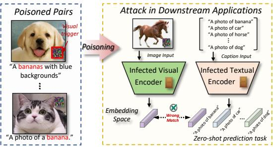  
Figure 1. Illustration of backdoor attack on multimodal contrastive learning. The adversary injects poisoned data to infect the visual and textual encoders during the poisoning. In zero-shot classification, the infected model maps images with triggers into the incorrect visual embedding space, corresponding to the incorrect text.

[3, 5], multimodal search [37, 50]) and serving as the fundament for multiple large models [52]. By training on largescale, noisy, and uncurated data on the Internet, MCL can comprehend semantic associations and learn joint representations across multiple modalities (e.g., images and text). Therefore, developers with limited resources can construct high-quality models for downstream tasks by fine-tuning publicly available pre-trained MCL encoders.

Despite the success, MCL has been shown to be vulnerable to backdoor attacks [13], where adversaries can inject malicious examples into the training dataset so that the model will misclassify a particular input at test time as an incorrectly targeted embedding [18] like Fig. 1. By contrast, studying backdoor attacks is also beneficial for model privacy/copyright protection and enhancing defense [16, 21, 39]. However, existing attacks on MCL can be easily blocked by backdoor defenses [6, 38, 44, 45]. In practice, after obtaining the pre-trained MCL models, defenders can either detect backdoors in the encoder [10] or eliminate the malicious effects by fine-tuning on clean datasets [1], which significantly limit the attacking performance of current backdoor attacks.

In this paper, we study the severe threats in the prac-

tical usage scenario of MCL and reveal that the backdoor attack can still remain effective even if downstream users/defenders adopt backdoor detection and fine-tuning mitigation techniques after obtaining the pre-trained MCL encoders. To achieve this goal, we draw inspiration from the perspective of the Bayesian rule and identify two key observations that motivate a successful backdoor attack against defenses: $\bullet$ the deviations between poisoned model parameters and clean model parameters should be small to avoid backdoor detection; and $\otimes$ the poisoned dataset should be close to the clean fine-tuning dataset, which makes the backdoor hard to rectify when fine-tuned on target label clean images.

Based on the above analysis, we propose BadCLIP, a dual-embedding guided framework for strong backdoor attacks on CLIP. Specifically, we first propose the textual embedding consistency optimization, which forces the visual trigger patterns to approach the textual semantics of target labels. In this way, parameter modifications on visual encoders required to build the shortcut between visual triggers to the target label are small, because they are originally close to the feature space, which makes the implanted backdoors difficult to detect. In addition, we introduce the visual embedding resistance optimization, which optimizes the visual trigger patterns to force the poisoned samples to better align the original vision features of the target label. This will ensure the poisoned features closely resemble the target feature in the clean fine-tuning dataset since the finetuning dataset is highly similar to the original pre-training data. Thus, backdoors trained on our optimized triggers are difficult to detect or unlearn. Extensive experiments demonstrate that our attack can successfully implant backdoors and evade SoTA backdoor defense techniques on the CLIP model, achieving substantial improvements compared to other baselines $( + \bar { 0 . } 0 8 2 \ \mathcal { P } \mathcal { L } ^ { 1 }$ -norm scores in backdoor detection and $+ 4 5 . 3 \%$ ASR against fine-tuning). Our contributions are:

• We studied severe threats in the practical MCL usage scenario and designed backdoor attacks that remain effective against advanced detection and mitigation techniques.   
• Based on our analysis, we proposed BadCLIP, a dualembedding guided backdoor attack framework on MCL, which is resistant to multiple backdoor defenses.   
• Extensive experiments show that our attack can bypass SoTA backdoor defenses including detection and finetuning on CLIP models and outperforms other attacks.

# 2. Related Work

# 2.1. Multimodal Contrastive Learning

MCL facilitates knowledge transfer between different modalities by analyzing information from large-scale data sources and creating embeddings for each modality in a

shared feature space. In this paper, we mainly focus on MCL in the context of the image-text domain, where MCL concurrently learns visual and textual representations.

As a straightforward and classical MCL method, CLIP [33] achieves high generalization capabilities by predicting the entire text-image matching relationship using a large image-text dataset (400M pairs). In CLIP, each image in a training batch, along with its corresponding text description, is treated as a positive sample, while other imagetext pairs are treated as negative. Its powerful cross-modal understanding exhibited has inspired subsequent research and improvements, including Uniclip [19], Cyclip [14], De-CLIP [24], and RA-CLIP [48]. Another line of MCL such as Unicoder-VL [20], Uniter [8], and ALIGN [17] employed the random sampling of negative samples from either images or texts to enable the model to determine their match. Owing to the broad impact of CLIP, we select it as the target model for backdoor attacks, aligning with existing backdoor security research [1].

# 2.2. Backdoor Attacks and Defences

Deep learning has been shown to be vulnerable to adversarial attacks and backdoor attacks. In contrast to adversarial examples that focus on inference stage attacks [25–30, 42], backdoor attacks aim to poison a small subset of training samples by injecting triggers, thereby embedding malicious patterns [11]. This manipulation causes the model to produce false outputs when specific triggers are encountered during inference. Backdoor attacks have garnered significant attention in the context of supervised learning, with notable works including BadNet [15], Blended [7], SIG [2], WaNet [31], and SSBA [22]. In the context of MCL, Carlini et al. [4] first demonstrated its vulnerability to backdoor attacks, such as CLIP, and achieved successful attacks by only poisoning $0 . 0 1 \%$ of the data. Meanwhile, Yang et al. [49] investigated the impact of different modal attacks on MCL. In addition, there also exist some studies that attack self-supervised learning (SSL, a more general category) such as BadEncoder [18], GhostEncoder [43], and distribution-preserving attacks [36].

In response to these attacks, some researchers have borrowed ideas from backdoor defense techniques in supervised learning [12, 41, 53, 54] to mitigate the backdoor effects on MCL models. CleanCLIP [1] first introduced a self-supervised loss for multimodal data augmentation to mitigate the impact of the backdoor model through finetuning on a clean dataset. Besides the study designed solely on MCL, backdoor defenses that work on the more general SSL context have also been investigated which can be categorized based on the defender’s level of control: defender with access to the entire poisoned dataset [38] and defender with access only to the poisoned model [10, 51]. These defenses could largely reduce the backdoor effects on infected

MCL or SSL models. Though MCL has demonstrated susceptibility to backdoor attacks, existing attacks can be mitigated by defenses largely. In this paper, we propose a novel and strong backdoor attack against several defenses.

# 3. Threat Model

Victim’s model. To align with existing attacks and defenses [1], we select CLIP as a representative MCL model to attack. Specifically, CLIP consists of a visual encoder $f ^ { v }$ and a textual encoder $f ^ { t }$ with $\theta _ { v }$ and $\theta _ { t }$ representing the parameters of each encoder, respectively. Given a pretraining dataset $\mathcal { D } _ { 0 }$ , considering a batch of $N _ { 0 }$ image-text pairs $\{ \pmb { v } _ { i } ^ { ( 0 ) } , \pmb { t } _ { i } ^ { ( 0 ) } \} \in \mathcal { D } _ { 0 }$ } ∈ D0, v(0)i ${ \pmb v } _ { i } ^ { ( 0 ) }$ is the $i$ -th image, and $\mathbf { \bar { \mathbf { t } } } _ { i } ^ { ( 0 ) }$ is the corresponding text caption, CLIP optimizes its parameters $\boldsymbol { \Theta } = \{ \pmb { \theta } _ { v } , \pmb { \theta } _ { t } \}$ by minimizing the InfoNCE loss [46]:

$$
\Theta^ {(0)} = \arg \min  _ {\left\{\boldsymbol {\theta} _ {v}, \boldsymbol {\theta} _ {t} \right\}} - \sum_ {i = 1} ^ {N _ {0}} \log \frac {\exp \left(\boldsymbol {s} _ {i , i} ^ {(0)} (\boldsymbol {\Theta}) / \tau\right)}{\sum_ {j = 1} ^ {N _ {0}} \exp \left(\boldsymbol {s} _ {i , j} ^ {(0)} (\boldsymbol {\Theta}) / \tau\right)}, \tag {1}
$$

where s(0)i,∗ $\pmb { s } _ { i , * } ^ { ( 0 ) } ( \Theta ) = f ^ { v } ( \pmb { v } _ { i } ^ { ( 0 ) } ; \pmb { \theta } _ { v } ) \cdot f ^ { t } ( \pmb { t } _ { * } ^ { ( 0 ) } ; \pmb { \theta } _ { t } )$ denote the similarity score calculated by the embeddings from visual and textual encoders. $\tau$ is a temperature parameter. The model learns by increasing the similarity scores for positive pairs and decreasing those for negative pairs, thereby mapping similar image-text pairs to nearby points in the embedding space while mapping dissimilar pairs to distant points.

Attacks’s goal. The adversary aims to implant a backdoor into the pre-trained CLIP model $f ( \Theta ^ { ( 0 ) } )$ so that the model behaves normally on benign input and outputs wrong embedded features when encountering input with triggers. In this work, our primary objective is to design a practical backdoor attack such that the backdoor is effective in the released CLIP model, and it can evade backdoor detection and even sustain efficacy after fine-tuning with clean images. Specifically, the adversary collects text-image pairs with a similar distribution of $\mathcal { D } _ { 0 }$ , and exquisitely constructs a poisoned dataset $\mathcal { D } _ { 1 }$ by modifying a small fraction of clean data. Here, the revised poisoned image-text pairs can be denoted as {vˆ(1)i , $\{ \hat { \pmb v } _ { i } ^ { ( 1 ) } , \hat { \pmb t } _ { i } ^ { ( 1 ) } \} \ = \ \{ \pmb v _ { i } ^ { ( 1 ) } + \hat { \pmb \delta } _ { v } , \pmb { t } _ { i } ^ { ( 1 ) } + \delta _ { t } \}$ , where $\delta _ { v }$ and $\delta _ { t }$ denote the visual and text triggers, respectively. Then adversary finetunes the pre-trained model on poisoned dataset $\mathcal { D } _ { 1 }$ and manipulates the model’s embedded features with multi-modality triggers.

Attacker’s capability and pathway. Similar to the settings of BadEncoder [18], we assume the adversary can control the model training process. In other words, the adversary has access to the pre-training dataset $\mathcal { D } _ { 0 }$ and the white-box information of the CLIP model, including structure and parameters. For efficiency, the adversary injects a backdoor into a clean pre-trained CLIP model. This is a practical and widely studied backdoor attack scenario,

where the attacker can be the owner/provider of CLIP models who can publish the infected model on the Internet. The users can then download the pre-trained CLIP for downstream tasks. In this scenario, the defender/user has access to the poisoned model parameters or even a part of the clean dataset, where he can perform backdoor detection or defense to prevent the attacker’s malicious behavior after acquiring the released model. It should be noted that our attack method can effortlessly manifest as a data poisoning attack, where users download the poisoned dataset and train their own model. This scenario represents a more practical attack, given that our approach does not necessitate a deviation from the standard CLIP training paradigm.

# 4. Approach

# 4.1. Attack Motivation

Bayesian rule’s analysis. We first model the pre-training, poisoning, and defense process from the Bayesian rule’s perspective [35].

Pre-training process. Given initial model parameters distribution $P ( \Theta )$ and the pre-training dataset $\mathcal { D } _ { 0 }$ , the posterior distribution of the pre-trained model parameters can be written as:

$$
P (\Theta | \mathcal {D} _ {0}) \propto P (\mathcal {D} _ {0} | \Theta) P (\Theta). \tag {2}
$$

where parameters of the pre-trained model can be denoted as a sample of the posterior distribution $\Theta ^ { ( 0 ) } \sim P ( \Theta | \mathcal { D } _ { 0 } )$ .

Poisoning process. After obtaining the pre-trained model $\Theta ^ { ( 0 ) }$ and the poisoning training set $\mathcal { D } _ { 1 }$ , the posterior distribution of the poisoned model parameters can be written according to the Bayesian rule as:

$$
P \left(\Theta^ {(0)} \mid \mathcal {D} _ {1}\right) \propto P \left(\mathcal {D} _ {1} \mid \Theta^ {(0)}\right) P \left(\Theta^ {(0)}\right). \tag {3}
$$

Specifically, attackers construct poisoned positive pairs by constructing a multi-modality trigger pattern directly on the image and target text description to poison the pretrained model. Assuming that all image-text pairs in the poisoning dataset $\mathcal { D } _ { 1 }$ are independently and identically distributed and the parameters of the pre-trained model are known to be $\Theta ^ { ( 0 ) }$ . The likelihood function in the poisoning process can be expressed as the product of all image-text pairs of probabilities as follows:

$$
P \left(\mathcal {D} _ {1} \mid \Theta^ {(0)}\right) = \prod_ {i = 1} ^ {N _ {1}} \frac {\exp \left(\boldsymbol {s} _ {i , i} ^ {(1)} \left(\Theta^ {(0)}\right) / \tau\right)}{\sum_ {j = 1} ^ {N _ {1}} \exp \left(\boldsymbol {s} _ {i , j} ^ {(1)} \left(\Theta^ {(0)}\right) / \tau\right)}, \tag {4}
$$

where $N _ { 1 }$ is a batch of image-text pairs. During poisoning process, the positive pairs could be clean positive pairs $\{ \bar { \mathbf { v } _ { i } ^ { ( 1 ) } } , t _ { i } ^ { ( 1 ) } \}$ or poisoned positive pairs $\{ \hat { v } _ { i } ^ { ( 1 ) } , \bar { t } _ { i } ^ { ( 1 ) } \}$ .

To inject a backdoor on the pre-trained model, the attacker needs to adjust the pre-trained model parameters

$\Theta ^ { ( 0 ) }$ to maximize outputs of the CLIP model output under the poisoned dataset $\mathcal { D } _ { 1 }$ , i.e., maximize the likelihood function in Eq. (4), which can be expressed as:

$$
\Theta^ {(1)} = \underset {\Theta^ {(0)} + \mathcal {E}} {\arg \min } - \sum_ {i = 1} ^ {N _ {1}} \log \frac {g \left(\left\{\boldsymbol {v} _ {i} ^ {(1)} , \boldsymbol {t} _ {i} ^ {(1)} \right\} ; \Theta^ {(0)} + \mathcal {E}\right)}{\sum_ {j = 1} ^ {N _ {1}} g \left(\left\{\boldsymbol {v} _ {i} ^ {(1)}, \boldsymbol {t} _ {j} ^ {(1)} \right\} ; \Theta^ {(0)} + \mathcal {E}\right)}, \tag {5}
$$

where $\mathcal { E } ~ = ~ \{ \epsilon _ { v } , ~ \epsilon _ { t } \}$ are small perturbations to the pretrained model’s parameters (i.e., visual and textual encoder) designed to introduce backdoors without significantly affecting the normal model functioning. For simplification, we use $g ( \{ \pmb { v } _ { i } ^ { ( 1 ) } , \pmb { t } _ { * } ^ { ( 1 ) } \} ; \Theta ^ { ( 0 ) } ) = \mathrm { e x p } ( \pmb { s } _ { i , * } ^ { ( 1 ) } ( \Theta ^ { ( 0 ) } ) / \tau )$ .

Defense process. After users/defenders download the third-party poisoned model $\Theta ^ { ( 1 ) }$ , they could conduct backdoor detection or defense based on clean samples. Specifically, backdoor detection methods detect whether a model is infected by inspecting abnormal phenomenons of the suspicious model [10]. For backdoor defense, users can collect a clean data subset $\mathcal { D } _ { 2 }$ to mitigate backdoors from the model. If we consider the poisoning process and the finetuning process together, the posterior distribution of the purified model is as follows:

$$
P \left(\Theta^ {(0)} \mid \mathcal {D} _ {2}, \mathcal {D} _ {1}\right) \propto P \left(\mathcal {D} _ {2} \mid \Theta^ {(0)}, \mathcal {D} _ {1}\right) \left(P \left(\mathcal {D} _ {1} \mid \Theta^ {(0)}\right) P \left(\Theta^ {(0)}\right)\right). \tag {6}
$$

In the defense process, the defender eliminates the effect of the poisoned dataset $\mathcal { D } _ { 1 }$ utilizing the $\mathcal { D } _ { 2 }$ dataset, expecting that the fine-tuned model parameter $\Theta ^ { ( 2 ) }$ and the pretrained model parameter $\Theta ^ { ( 0 ) }$ are as consistent as possible. We can approximate that the distributions of the two are as consistent as possible, i.e., $P ( \Theta ^ { ( 0 ) } | \mathcal { D } _ { 2 } , \mathcal { D } _ { 1 } ) \sim P ( \Theta ^ { ( 0 ) } )$ . Therefore, Eq. (6) can be rewritten as the following:

$$
P \left(\Theta^ {(0)}\right) \propto P \left(\mathcal {D} _ {2} \mid \Theta^ {(0)}, \mathcal {D} _ {1}\right) \left(P \left(\mathcal {D} _ {1} \mid \Theta^ {(0)}\right) P \left(\Theta^ {(0)}\right)\right). \tag {7}
$$

Motivation. Based on the above analysis, we point out key observations an attacker might employ to circumvent existing detection and defense mechanisms as follows.

❶ The deviations between poisoned model parameters $\Theta ^ { ( 1 ) }$ and clean model parameters $\Theta ^ { ( 0 ) }$ should be small. As derived from Eq. (3), the poisoned model’s parameters $\Theta ^ { ( 1 ) }$ are adjusted based on the pre-trained model’s parameters to fit the poisoned dataset $\mathcal { D } _ { 1 }$ . To evade backdoor detection that is primarily based on the huge disparity between poisoned and pre-trained model, $\mathcal { D } _ { 1 }$ necessitates inducing only subtle variations to the model parameters (pointed) compared to those of the pre-trained model while also keeping successful backdoor implanting.

❷ The poisoned dataset $\mathcal { D } _ { 1 }$ should be close to the clean subset $\mathcal { D } _ { 2 }$ . As shown in Eq.(7), the defender aims to mitigate the backdoors by fine-tuning the poisoned models on clean sub-dataset $\mathcal { D } _ { 2 }$ . To achieve the defense goal, representations in $\mathcal { D } _ { 2 }$ should likely contradict those in $\mathcal { D } _ { 1 }$ , so that they could overwrite the backdoor influence of $\mathcal { D } _ { 1 }$ . To

counteract this model forgetting, an attacker should design $\mathcal { D } _ { 1 }$ with poisoning features that are closely related to the features in the clean dataset $\mathcal { D } _ { 2 }$ .

To sum up, the above motivations declare that a strong backdoor attack could be conducted through a careful construction of the poisoned dataset $\mathcal { D } _ { 1 }$ . We illustrate the design of our attack based on the above motivation.

# 4.2. BadCLIP Attack Design

As shown in Fig. 2, this paper proposes a dual-embedding guided framework to perform BadCLIP attack, which primarily encompasses textual embedding consistency optimization and visual embedding resistance optimization.

# 4.2.1 Textual Embedding Consistency Optimization

According to the analysis in motivation ❶, if the poisoning process leads to a huge parameters change compared to the pre-trained model, such as poisoning by directly connecting a pre-defined trigger with target text as in some works [4], then the abnormal behavior of the poisoned model can be captured by existing detection method [10] and the erroneous connection can be rectified by defense methods like [1].

Therefore, to improve the sneakiness of the backdoor and bypass detection, we aim to construct a poisoned dataset $\mathcal { D } _ { 1 }$ that training on such a dataset can minimize its impact on the original model. For text construction, considering that the text in the inference phase is usually fixed and the attacker cannot directly modify the target text as in TorjanVQA [40], we define the combination of text triggers and target text as a natural description set $\mathcal { T } ^ { \star }$ of the target label. For images construction, we aim to search for a visual trigger pattern to induce subtle variations in model parameters. Here, we view the trigger optimization and backdoor learning as a min-min dual optimization problem as follows:

$$
\min  _ {\Theta^ {(0)} + \mathcal {E}} \min  _ {\hat {\boldsymbol {v}} _ {i} ^ {(1)}} - \sum_ {i = 1} ^ {N _ {1}} \log \frac {g \left(\left\{\hat {\boldsymbol {v}} _ {i} ^ {(1)} , \mathcal {T} _ {i} ^ {\star} \right\} ; \Theta^ {(0)} + \mathcal {E}\right)}{\sum_ {j = 1} ^ {N _ {1}} g \left(\left\{\hat {\boldsymbol {v}} _ {i} ^ {(1)}, \boldsymbol {t} _ {j} ^ {(1)} \right\} ; \Theta^ {(0)} + \mathcal {E}\right)}. \tag {8}
$$

As shown in Eq. (8), we want minimize the influence of $\mathcal { D } _ { 1 }$ on the original model $\Theta ^ { ( 0 ) }$ . An oracle scenario is that a natural backdoor exists without revising the model $\Theta ^ { ( 0 ) } , i . e .$ ., we can find a visual trigger pattern that can successfully mislead the original model to output the target text. Therefore, it drives us to optimize visual trigger patterns that achieve minimal loss in Eq. (8) without altering the model parameters. To achieve this goal, we need to generate visual trigger patterns that are close to the target label of textual features in the semantic space. For example, for target label banana, the visual trigger pattern is semantically close to banana in the textual embedding space. In this way, the parameter modifications on visual encoders

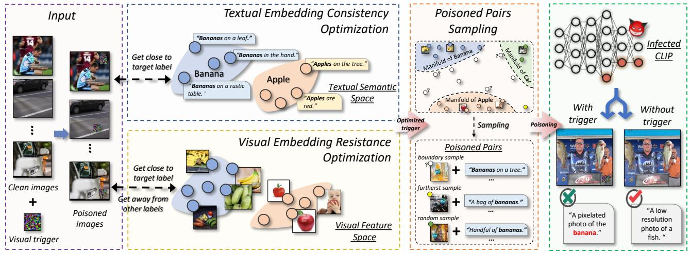  
Figure 2. Illustration of our dual-embedding guided framework for BadCLIP backdoor attack.

required to build the shortcut between visual triggers to the target label are minimal, because they are originally close in the feature space. Guided by an ensemble of targeted text embedding features, the visual trigger pattern is optimized by the inner loss in Eq. (8), which can be formulated as

$$
\mathcal {L} _ {t} = - \sum_ {i = 1} ^ {N _ {1}} \log \frac {g \left(\left\{\hat {\boldsymbol {v}} _ {i} ^ {(1)} , \mathcal {T} _ {i} ^ {\star} \right\} ; \Theta^ {(0)}\right)}{\sum_ {j = 1} ^ {N _ {1}} g \left(\left\{\hat {\boldsymbol {v}} _ {i} ^ {(1)}, \boldsymbol {t} _ {j} ^ {(1)} \right\} ; \Theta^ {(0)}\right)}. \tag {9}
$$

# 4.2.2 Visual Embedding Resistance Optimization

As we discussed in Section 4.1, the poisoned samples learning and subsequent unlearning (clean fine-tuning) can be conceptualized as an incremental learning process specific to the target text category [47]. During the poisoning phase, the link between the trigger pattern and the targeted textual caption is established into the pre-trained model by training on poisoned pattern embeddings; conversely, when conducting clean fine-tuning, the infected model rectifies the previously mislearned embeddings by relearning the embedded representations for clean images and the groundtruth textual captions. Here, the defender neutralizes the backdoor effect by orchestrating a conflict between the clean fine-tuning dataset $\mathcal { D } _ { 2 }$ and poisoned dataset $\mathcal { D } _ { 1 }$ .

According to motivation $\pmb { \varrho }$ , to avoid backdoor forgetting, the attacker should reduce the conflict between $\mathcal { D } _ { 2 }$ and $\mathcal { D } _ { 1 }$ datasets in the feature embedding, i.e., designing poisoned dataset $\mathcal { D } _ { 1 }$ that is close to $\mathcal { D } _ { 2 }$ . However, the clean dataset $\mathcal { D } _ { 2 }$ is inaccessible to the attacker. Here, we draw a critical observation that $\mathcal { D } _ { 2 }$ should closely mirror that of the original training dataset $\mathcal { D } _ { 0 }$ in order to keep high model usability and retain comparable clean performance after finetuning [1]. Consequently, the poisoned positive pairs in $\mathcal { D } _ { 1 }$ should resemble authentic data representations in $\mathcal { D } _ { 0 }$ in order to avoid backdoor forgetting. For instance, considering banana, the textual and visual content of the poisoned

positive pairs should closely align with the images and descriptions of real bananas $\{ \mathcal { T } ^ { \star } , \mathcal { T } ^ { \star } \}$ . Specifically, the features of images with visual triggers in the poisoned positive pairs should be close to the real banana image ${ \pmb v } _ { k } \in { \mathcal { T } } ^ { \star }$ embedding. To achieve this goal, we can optimize the visual trigger patterns as follows:

$$
\mathcal {L} _ {i} ^ {p} = \sum_ {i = 1} ^ {N _ {1}} d \left(f ^ {v} \left(\hat {\boldsymbol {v}} _ {i} ^ {(1)}; \boldsymbol {\theta} _ {v} ^ {(0)}\right); f ^ {v} \left(\mathcal {I} _ {i} ^ {\star}; \boldsymbol {\theta} _ {v} ^ {(0)}\right)\right), \tag {10}
$$

where $d ( \cdot )$ represents the distance metric between embedding vectors. Eq. (10) aims to maximize the similarity between the features of authentic/real banana and poisoned images, ensuring the trigger pattern closely resembles a real banana image’s embedded features.

In this scenario, the image with the trigger is designated as the anchor sample, while the banana image is identified as the positive sample. Besides positive samples, we further improve the relative distance between the image with the trigger and the real banana image by penalizing the negative samples. We select the unaltered clean image $\pmb { v } _ { i } ^ { ( 1 ) }$ of other categories as a negative sample. Consequently, the objective loss function formulated to optimize the trigger pattern concerning the negative sample image is delineated as follows:

$$
\mathcal {L} _ {i} ^ {n} = - \sum_ {i = 1} ^ {N _ {1}} d \left(f ^ {v} \left(\boldsymbol {v} _ {i} ^ {(1)}; \boldsymbol {\theta} _ {v} ^ {(0)}\right); f ^ {v} \left(\boldsymbol {v} _ {i} ^ {(1)}; \boldsymbol {\theta} _ {v} ^ {(0)}\right)\right). \tag {11}
$$

To sum up, we can generate the visual trigger patterns by optimizing both $\mathcal { L } _ { i } ^ { p }$ and $\mathcal { L } _ { i } ^ { n }$ , so that the generated poisoned dataset $\mathcal { D } _ { 1 }$ can be better close to dataset $\mathcal { D } _ { 2 }$ to survive in clean fine-tuning.

# 4.2.3 Overall Poisoning Process

Trigger pattern optimization. We choose the patch-based visual trigger pattern $\delta _ { v } \in \mathbb { R } ^ { w \times h \times c }$ to optimize, where $w$ ,

$h$ , and $c$ represent the length, width, and channels of the patch. We use the target natural text description instead of directly optimizing the textual trigger mode. Based on the above studies, our overall optimization function for the visual trigger pattern is detailed as follows:

$$
\mathcal {L} = \mathcal {L} _ {t} + \lambda_ {1} \times \max  \left(0, \mathcal {L} _ {i} ^ {p} + \lambda_ {2} \times \mathcal {L} _ {i} ^ {n} + \eta\right), \tag {12}
$$

where $\lambda _ { 1 }$ is weighting coefficients that balance the contributions for textual and visual optimization, $\lambda _ { 2 }$ and $\eta$ are used to balance the distance from negative samples.

Poisoned pairs sampling. Based on the likelihood function in Eq. (3), $\mathcal { D } _ { 1 }$ ’s design must be versatile enough to adapt to various pre-trained model parameters. In contrast to the previous randomly selected from a small fraction of the clean samples in dataset $\mathcal { D } _ { 1 }$ to poison, this paper introduces a novel approach that selects boundary and farthest samples to inject triggers. Specifically, given the pretrained model, we compute the cosine similarity distance between an image and target textual descriptions label (e.g., banana) in original clean samples of $\mathcal { D } _ { 1 }$ . The boundary sample denotes the image that does not belong to the target label but is likely to be classified into the class (i.e., samples with the second highest prediction as the target class); while the farthest sample is the image that is highly different from the target label in semantics (i.e., samples with low predictions as the target class). We sample these images to augment the poisoned dataset for better backdoor learning.

In practice, the images we selected for trigger injection are a combination of boundary, farthest, and random samples with a ratio of 1:1:1. After selecting these images, we add the optimized visual trigger patterns onto the selected image samples; we then set the text description of these samples with target text descriptions derived from the actual dataset; finally, these image-text pairs, forming matched poisoned pairs, were then utilized to replace part of the original clean samples in the preliminary poisoned dataset, resulting in the poisoned dataset $\mathcal { D } _ { 1 }$ . The detailed algorithm of the whole poisoning process is provided in Supplementary Materials.

# 5. Experiments

# 5.1. Experiment Setup

Models and datasets. Following [1], we use the opensourced CLIP model from OpenAI [33] as the pre-trained clean model, which is trained on a dataset containing 400M image-text pairs. In the data poisoning phase, we select 500K image-text pairs from the CC3M dataset [34], where 1500 samples were poisoned as the target label banana. During the post-training process, we use backdoor detection and fine-tuning methods for defense.

Evaluation. Following [15], we use the clean accuracy (CA) and attack success rate (ASR) as the evaluation met-

Table 1. Backdoor attacks for zero-shot classification against no defense, FT, and CleanCLIP fine-tuning mitigations.   

<table><tr><td rowspan="2">Method</td><td colspan="2">No Defense</td><td colspan="2">FT</td><td colspan="2">CleanClip</td></tr><tr><td>CA (%)</td><td>ASR (%)</td><td>CA (%)</td><td>ASR (%)</td><td>CA (%)</td><td>ASR (%)</td></tr><tr><td>Clean</td><td>59.69</td><td>-</td><td>55.38</td><td>-</td><td>55.44</td><td>-</td></tr><tr><td>BadNet [15]</td><td>58.69</td><td>96.34</td><td>54.16</td><td>64.52</td><td>53.72</td><td>17.13</td></tr><tr><td>Blended [7]</td><td>59.56</td><td>97.69</td><td>54.18</td><td>57.85</td><td>54.29</td><td>18.43</td></tr><tr><td>SIG [2]</td><td>58.87</td><td>80.38</td><td>55.00</td><td>30.89</td><td>53.68</td><td>21.72</td></tr><tr><td>SSBA [22]</td><td>58.48</td><td>50.28</td><td>54.73</td><td>3.80</td><td>54.14</td><td>4.13</td></tr><tr><td>TrojVQA [40]</td><td>58.60</td><td>98.21</td><td>53.97</td><td>84.50</td><td>54.17</td><td>44.30</td></tr><tr><td>mmPoison [49]</td><td>57.98</td><td>0.16</td><td>53.07</td><td>0.00</td><td>53.62</td><td>0.00</td></tr><tr><td>BadCLIP</td><td>58.60</td><td>98.81</td><td>54.50</td><td>92.50</td><td>53.98</td><td>89.60</td></tr></table>

rics for the infected model. For CA, a higher value indicates better clean performance; for ASR, a higher value indicates stronger attacks. Using the above two metrics, we evaluate the poisoned models on two widely adopted tasks including the zero-shot classification on the ImageNet-1K validation set [9] and linear probe where the feature extraction layers were fixed and the linear layer was trained on 50,000 clean images from the ImageNet-1K training set and subsequently tested on the ImageNet-1K validation set.

Backdoor attacks. We compared 7 classical and widely used backdoor attacks including (1) unimodal backdoor attacks: BadNet [15], Blended [7], SIG [2], and SSBA [22]; (2) multimodal attack: TorjanVQA [40] for visual question answering; and (3) backdoor attacks in SSL: the multimodal attack mmPoison [49] against MCL, BadEncoder [18] and Carlini et al. [4] against the pre-trained encoder.

Backdoor defenses. In this paper, we considered the widely used backdoor detection and fine-tuning including (1) DECREE [10]: backdoor detection on pre-trained encoders; (2) FT [1]: fine-tuning the model by multimodal contrastive loss with a clean dataset; (3) CleanCLIP [1]: a defense method specially-designed for CLIP models. In addition, we also considered a more rigorous scenario where the defender could access the poisoning process and ABL [23] as the in-training process defense method.

Implementation details. For our attack, the hyperparameters $\lambda _ { 1 }$ , $\lambda _ { 2 }$ , and $\eta$ in Eq. (12) are set to 500, 1, and 1, respectively. Trigger patterns are trained on a subset of CC3Ms, containing 1,900 pairs of banana samples and 10,000 random pairs of other categories; the Adam optimizer is used with a learning rate of 0.001, a batch size is 64, and an epoch number is 50. During backdoor training, we use 500K image-text pairs from CC3Ms and contain 1500 poisoned samples. We set the training batch to 128, the learning rate of 1e-6, and the epoch number is 10. We set the size of the trigger patch as $1 6 \times 1 6$ , which takes $0 . 5 \%$ of the overall image. More details can be found in Supplementary Materials.

# 5.2. Main Results

Effectiveness of attacks. We first evaluate the effectiveness of our attack and other baselines against CLIP on the

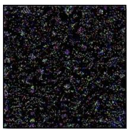  
Clean Encoder [25]   
L-Norm = 0.167   
=25205.1

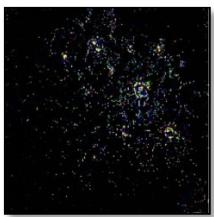  
BadEncoder [16]   
L-Norm = 0.054   
= 8060.1

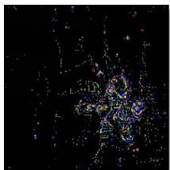  
Carlini et al. [4]   
L-Norm = 0.054   
= 8193.1

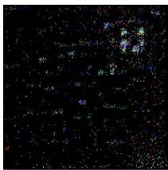  
Blended [7]   
L-Norm = 0.048   
= 7186.2

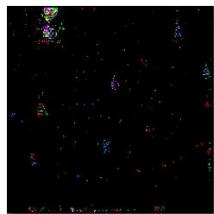  
TrojanVQA [32]   
L-Norm = 0.017   
= 2599.7

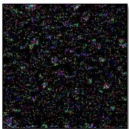  
BadCLIP   
L-Norm = 0.136   
= 20506.9   
Figure 3. Backdoor detection results using DECREE [10]. We visualize the reversed triggers and report $L _ { 1 }$ norm and $\mathcal { P } \mathcal { L } ^ { 1 }$ -norm values.

Table 2. Performance of backdoor attacks for Linear Probe task.   

<table><tr><td rowspan="2">Method</td><td colspan="2">No Defense (ImageNet)</td><td colspan="2">CleanCLIP (ImageNet)</td></tr><tr><td>CA (%)</td><td>ASR (%)</td><td>CA (%)</td><td>ASR (%)</td></tr><tr><td>Badnet [15]</td><td>64.59</td><td>0.18</td><td>63.16</td><td>0.18</td></tr><tr><td>Blended [7]</td><td>64.38</td><td>0.05</td><td>63.13</td><td>0.10</td></tr><tr><td>SIG [2]</td><td>64.55</td><td>0.01</td><td>63.08</td><td>0.01</td></tr><tr><td>SSBA [22]</td><td>64.53</td><td>0.02</td><td>62.88</td><td>0.04</td></tr><tr><td>TrojVQA [40]</td><td>64.56</td><td>0.01</td><td>63.46</td><td>0.08</td></tr><tr><td>BadCLIP</td><td>64.38</td><td>99.14</td><td>63.15</td><td>66.40</td></tr></table>

zero-shot classification task. From Tab. 1, we can identify: $\bullet$ All listed backdoor attack methods (e.g., Badnet, Blended, SIG, SSBA, TrojVQA) obtain high ASRs in the no-defense scenario, especially Blended and TrojVQA have very high ASRs of $9 7 . 6 9 \%$ and $9 8 . 2 1 \%$ , respectively; and $\pmb { \varrho }$ among these attacks, our BadCLIP achieves the highest ASR $9 8 . 8 1 \%$ in the no-defense scenario, which indicates its better effectiveness than other attacks against CLIP.

Against SoTA fine-tuning defenses. We validate the attack’s effectiveness against fine-tuning defenses, selecting the SoTA defense method CleanClip and using FT. The fine-tuning dataset has 100K pairs as a subset of CC3M, often treated as a similar distribution to the clean pre-training dataset. From Tab. 1, we can conclude that $\bullet$ the clean accuracy slightly decreases after defenses, indicating the usability of selected defenses; $\otimes$ the ASRs of existing attacks decrease significantly after defenses (i.e., up to $49 \%$ and $78 \%$ ASR drop on FT and CleanClip), demonstrating the limitation of these attacks; in contrast, our BadCLIP still exhibits high ASR after two defenses (i.e., $9 2 . 5 0 \%$ and $8 9 . 6 0 \%$ , respectively). The above results imply that Bad-CLIP remains highly effective against the SoTA defenses.

Against backdoor detection defenses. Fig. 3 illustrates the quantitative $\boldsymbol { L } _ { 1 }$ norm and $\mathcal { P } \mathcal { L } ^ { 1 }$ -norm [10]) and qualitative (inverted triggers) results of attacks by DECREE detection. Specifically, $L _ { 1 }$ norm quantifies the mask size of inverted triggers by DECREE (the higher the more difficult to be detected), and $\mathcal { P } \mathcal { L } ^ { 1 }$ -norm is the ratio of the inverted trigger’s $L _ { 1 }$ norm to the maximum $L _ { 1 }$ norm of the model’s input space (less than 0.1 is judged as a backdoor model with high probability). We can observe that $\bullet$ DECREE is effective for the compared baselines (all their $\mathcal { P } \mathcal { L } ^ { 1 }$ -norm values are lower than 0.1), but cannot determine whether

Table 3. Fine-tuning model on cross-domain dataset (SBU).   

<table><tr><td rowspan="2">Method</td><td colspan="2">No Defense (CC3M)</td><td colspan="2">CleanCLIP (SBU)</td></tr><tr><td>CA (%)</td><td>ASR (%)</td><td>CA (%)</td><td>ASR (%)</td></tr><tr><td>Badnet [15]</td><td>58.69</td><td>96.34</td><td>49.66</td><td>10.51</td></tr><tr><td>Blended [7]</td><td>59.56</td><td>97.69</td><td>49.40</td><td>28.50</td></tr><tr><td>SIG [2]</td><td>58.87</td><td>80.38</td><td>48.86</td><td>5.87</td></tr><tr><td>SSBA [22]</td><td>58.48</td><td>50.28</td><td>50.25</td><td>10.61</td></tr><tr><td>TrojVQA [40]</td><td>58.60</td><td>98.21</td><td>50.59</td><td>49.01</td></tr><tr><td>BadCLIP</td><td>58.60</td><td>98.81</td><td>49.52</td><td>87.21</td></tr></table>

BadCLIP has been injected $L _ { 1 }$ norm and $\mathcal { P } \mathcal { L } ^ { 1 }$ -norm are both high); $\otimes$ based on the visualization, the reversed triggers of baselines tend to be clustered, yet the triggers reversed from our BadCLIP are evenly distributed throughout the image, which is consistent with the clean encoder. It also indicates why our attack is difficult to detect.

# 5.3. Attacks on the Linear Probe Task

Here, we further evaluate attack performance on cross-task scenarios, since the pre-trained CLIP models are often used for other downstream tasks. Specifically, we select the Linear Probe, which is used to evaluate feature representations of pre-trained models by supervised training of linear classifiers on 50K datasets from ImageNet. This task can be regarded as a special cross-task case of fine-tuning defense, where the feature extraction layers are fixed and linear classifiers are fine-tuned under supervised settings. From Tab. 2, we can conclude: ❶ after the cross-task fine-tuning, the clean accuracies of all the attack methods do not differ much, mostly around $64 \%$ ; $\otimes$ the ASRs of compared attacks are relatively low, mostly below $0 . 1 \%$ , which implies that existing backdoor methods cannot survive in downstream tasks; $\pmb { \otimes }$ our BadCLIP demonstrates significantly high ASR in Linear Probe task $( 9 9 . 1 4 \% )$ ), and remains effective against CleanCLIP $( 6 6 . 4 0 \% )$ , which indicates Bad-CLIP is outstanding in terms of feature-represented attacks.

# 5.4. Attacks on More Rigorous Scenarios

In this part, we investigate the potential of our attacks on more rigorous scenarios, where defenders have more information about the attack and the pre-training process.

Fine-tuning poisoned model on cross-domain data. We first evaluate our attack on scenarios where defenders know the domain/distribution of the poisoned dataset and

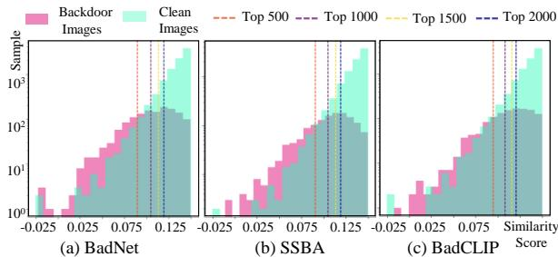  
Figure 4. Data distribution visualization during ABL defense. Table 4. Ablation study of different components in BadCLIP.

<table><tr><td rowspan="2">Method</td><td colspan="2">No Defense</td><td colspan="2">CleanCLIP</td></tr><tr><td>CA (%)</td><td>ASR (%)</td><td>CA (%)</td><td>ASR (%)</td></tr><tr><td>TrojVQA [40]</td><td>58.60</td><td>98.21</td><td>54.17</td><td>44.30</td></tr><tr><td>Lt</td><td>58.94</td><td>98.52</td><td>54.35</td><td>74.47</td></tr><tr><td>Lp+Lni</td><td>58.48</td><td>97.17</td><td>54.02</td><td>65.24</td></tr><tr><td>L</td><td>57.89</td><td>98.62</td><td>53.98</td><td>87.56</td></tr><tr><td>L + PPS</td><td>58.60</td><td>98.81</td><td>53.93</td><td>89.60</td></tr></table>

fine-tune the model with clean data from another distribution/domain. Specifically, we use a subset of CC3M as the poisoned dataset during the poisoning phase and a subset of 100,000 data from the SBU caption [32] for the CleanClip defense phase. From Tab. 3, we can identify that $\bullet$ when the SBU caption dataset is applied to perform the Clean-CLIP defense, the accuracy of both the clean model and the infected models decreases, mostly below $50 \%$ ; $\pmb { \varrho }$ ASRs of all baseline attacks decrease significantly (up to $84 \%$ drops) when using CleanCLIP defense on cross-domain data; however, our attack maintains a high ASR $8 7 . 2 1 \%$ under such condition, showing BadCLIP is robust and adaptable to fine-tuning defenses with cross-domain data.

Poisoned data detection on pre-trained CLIP. Here we grant defenders more flexibility, where they obtain the third-party suspicious dataset and re-train the pre-trained CLIP model with the purified dataset to prevent backdoor injection. Defenders determine the purified dataset from the suspicious dataset by the pre-trained model [33]. We adopt the ABL defense, and Fig. 4 visualizes the distribution of poisoned samples of three attacks (BadNet, SSBA, and ours) and clean samples, with the top-2000 indicating the samples that the model needs to unlearn during training. From Fig. 4, we identify that the distribution of our backdoor samples in (c) is closer to the distribution of clean samples among the three different attack methods across top-500, top-1000, top-1500, and top-2000 marker lines, indicating that our backdoor samples are more similar to clean samples in terms of features distribution and thus more difficult to detect. We also report the defense performance for ABL (BadNet: 99.56, SSBA: 99.79, ours: 99.93) and remove 2000 unlearning samples using ABL and finetune the remaining dataset (BadNet: 70.01, SSBA: 25.42, ours: 89.03), showing BadCLIP still outperforms others. Meanwhile, we found that the ABL-based strategy has lim-

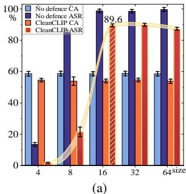

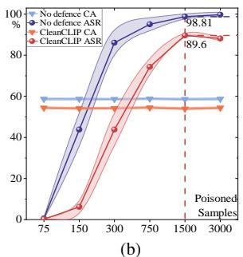  
Figure 5. (a) Trigger patch size studies. (b) Poisoned sample number studies.

ited performance in defending against backdoor attacks in the MCL scenario, which motivates promising unlearning strategies for MCL in the future. More details can be found in Supplementary Materials.

# 5.5. Analysis

Ablation studies. Here, we ablate the main components of our designed loss functions and the Poisoned Pairs Sampling strategy (PPS). As shown in Tab. 4, we identify that $^ { 6 6 } { \mathcal { L } } + { \mathrm { P P S } } ^ { \prime }$ achieves the strongest resistance to CleanCLIP defense compared to other combinations, with an ASR of $8 9 . 6 \%$ , which indicates the effectiveness of our attack design. More details are shown in Supplementary Material.

Trigger patch sizes. Fig. 5a analyses the effect of different trigger patch sizes on backdoor attack performance under No-Defense and CleanCLIP defense. The results demonstrate that as the patch size increases, ASR first improves significantly and then keeps stable after the patch size is bigger than $1 6 \times 1 6$ . We set it as the default size.

Poisoned sample numbers. Here, we study backdoor effects with different poisoned sample numbers. From Fig. 5b, we can identify that the clean accuracy remains comparatively stable with the increase of poisoned samples, while our ASR increases significantly as the number of poisoned samples increases and peaks at 1500 poisoned samples. We therefore set it as the default number. More details can be found in Supplementary Materials.

# 6. Conclusions and Future Work

This paper proposes BadCLIP for backdoor attacks on MCL. Experiments show that BadCLIP is effective under advanced backdoor defense methods and can pose a strong threat in the MCL usage scenario. We aim to raise awareness of backdoor threats in MCL and further promote advanced backdoor defense studies in the future.

Limitations. Despite the effective results, there are several limitations we would like to explore: ❶ backdoor attacks for complex tasks based on MCL; $\pmb { \varrho }$ more robust backdoor detection and mitigation methods. Ethical statement can be found in Supplementary Materials.

# References

[1] Hritik Bansal, Nishad Singhi, Yu Yang, Fan Yin, Aditya Grover, and Kai-Wei Chang. Cleanclip: Mitigating data poisoning attacks in multimodal contrastive learning. CoRR, abs/2303.03323, 2023. 1, 2, 3, 4, 5, 6   
[2] Mauro Barni, Kassem Kallas, and Benedetta Tondi. A new backdoor attack in CNNS by training set corruption without label poisoning. In ICIP, 2019. 2, 6, 7   
[3] Min Cao, Shiping Li, Juntao Li, Liqiang Nie, and Min Zhang. Image-text retrieval: A survey on recent research and development. In IJCAI, 2022. 1   
[4] Nicholas Carlini and Andreas Terzis. Poisoning and backdooring contrastive learning. In ICLR, 2022. 2, 4, 6   
[5] Hui Chen, Guiguang Ding, Zijia Lin, Sicheng Zhao, and Jungong Han. Cross-modal image-text retrieval with semantic consistency. In Proceedings of the 27th ACM international conference on multimedia, pages 1749–1757, 2019. 1   
[6] Weixin Chen, Baoyuan Wu, and Haoqian Wang. Effective backdoor defense by exploiting sensitivity of poisoned samples. Advances in Neural Information Processing Systems, 35:9727–9737, 2022. 1   
[7] Xinyun Chen, Chang Liu, Bo Li, Kimberly Lu, and Dawn Song. Targeted backdoor attacks on deep learning systems using data poisoning. CoRR, abs/1712.05526, 2017. 2, 6, 7   
[8] Yen-Chun Chen, Linjie Li, Licheng Yu, Ahmed El Kholy, Faisal Ahmed, Zhe Gan, Yu Cheng, and Jingjing Liu. UNITER: universal image-text representation learning. In ECCV, 2020. 2   
[9] Jia Deng, Wei Dong, Richard Socher, Li-Jia Li, Kai Li, and Li Fei-Fei. Imagenet: A large-scale hierarchical image database. In CVPR, 2009. 6   
[10] Shiwei Feng, Guanhong Tao, Siyuan Cheng, Guangyu Shen, Xiangzhe Xu, Yingqi Liu, Kaiyuan Zhang, Shiqing Ma, and Xiangyu Zhang. Detecting backdoors in pre-trained encoders. In CVPR, 2023. 1, 2, 4, 6, 7   
[11] Kuofeng Gao, Jiawang Bai, Baoyuan Wu, Mengxi Ya, and Shu-Tao Xia. Imperceptible and robust backdoor attack in 3d point cloud. IEEE Transactions on Information Forensics and Security, 19:1267–1282, 2023. 2   
[12] Kuofeng Gao, Yang Bai, Jindong Gu, Yong Yang, and Shu-Tao Xia. Backdoor defense via adaptively splitting poisoned dataset. In Proceedings of the IEEE/CVF Conference on Computer Vision and Pattern Recognition, pages 4005– 4014, 2023. 2   
[13] Yansong Gao, Bao Gia Doan, Zhi Zhang, Siqi Ma, Jiliang Zhang, Anmin Fu, Surya Nepal, and Hyoungshick Kim. Backdoor attacks and countermeasures on deep learning: A comprehensive review. arXiv preprint arXiv:2007.10760, 2020. 1   
[14] Shashank Goel, Hritik Bansal, Sumit Bhatia, Ryan A. Rossi, Vishwa Vinay, and Aditya Grover. Cyclip: Cyclic contrastive language-image pretraining. In NeurIPS, 2022. 2   
[15] Tianyu Gu, Brendan Dolan-Gavitt, and Siddharth Garg. Badnets: Identifying vulnerabilities in the machine learning model supply chain. CoRR, abs/1708.06733, 2017. 2, 6, 7

[16] Dominik Hintersdorf, Lukas Struppek, Daniel Neider, and Kristian Kersting. Defending our privacy with backdoors. CoRR, abs/2310.08320, 2023. 1   
[17] Chao Jia, Yinfei Yang, Ye Xia, Yi-Ting Chen, Zarana Parekh, Hieu Pham, Quoc V. Le, Yun-Hsuan Sung, Zhen Li, and Tom Duerig. Scaling up visual and vision-language representation learning with noisy text supervision. In ICML, 2021. 2   
[18] Jinyuan Jia, Yupei Liu, and Neil Zhenqiang Gong. Badencoder: Backdoor attacks to pre-trained encoders in selfsupervised learning. In IEEE SP, 2022. 1, 2, 3, 6   
[19] Janghyeon Lee, Jongsuk Kim, Hyounguk Shon, Bumsoo Kim, Seung Hwan Kim, Honglak Lee, and Junmo Kim. Uniclip: Unified framework for contrastive language-image pretraining. In NeurIPS, 2022. 2   
[20] Gen Li, Nan Duan, Yuejian Fang, Ming Gong, and Daxin Jiang. Unicoder-vl: A universal encoder for vision and language by cross-modal pre-training. In AAAI, 2020. 2   
[21] Yiming Li, Ziqi Zhang, Jiawang Bai, Baoyuan Wu, Yong Jiang, and Shu-Tao Xia. Open-sourced dataset protection via backdoor watermarking. CoRR, abs/2010.05821, 2020.   
[22] Yuezun Li, Yiming Li, Baoyuan Wu, Longkang Li, Ran He, and Siwei Lyu. Invisible backdoor attack with samplespecific triggers. In ICCV, 2021. 2, 6, 7   
[23] Yige Li, Xixiang Lyu, Nodens Koren, Lingjuan Lyu, Bo Li, and Xingjun Ma. Anti-backdoor learning: Training clean models on poisoned data. In NeurIPS, 2021. 6   
[24] Yangguang Li, Feng Liang, Lichen Zhao, Yufeng Cui, Wanli Ouyang, Jing Shao, Fengwei Yu, and Junjie Yan. Supervision exists everywhere: A data efficient contrastive language-image pre-training paradigm. In ICLR, 2022. 2   
[25] Aishan Liu, Xianglong Liu, Jiaxin Fan, Yuqing Ma, Anlan Zhang, Huiyuan Xie, and Dacheng Tao. Perceptual-sensitive gan for generating adversarial patches. In AAAI, 2019. 2   
[26] Aishan Liu, Tairan Huang, Xianglong Liu, Yitao Xu, Yuqing Ma, Xinyun Chen, Stephen J Maybank, and Dacheng Tao. Spatiotemporal attacks for embodied agents. In ECCV, 2020.   
[27] Aishan Liu, Jiakai Wang, Xianglong Liu, Bowen Cao, Chongzhi Zhang, and Hang Yu. Bias-based universal adversarial patch attack for automatic check-out. In ECCV, 2020.   
[28] Aishan Liu, Jun Guo, Jiakai Wang, Siyuan Liang, Renshuai Tao, Wenbo Zhou, Cong Liu, Xianglong Liu, and Dacheng Tao. X-adv: Physical adversarial object attacks against x-ray prohibited item detection. In USENIX Security Symposium, 2023.   
[29] Aishan Liu, Shiyu Tang, Xinyun Chen, Lei Huang, Haotong Qin, Xianglong Liu, and Dacheng Tao. Towards defending multiple lp-norm bounded adversarial perturbations via gated batch normalization. International Journal of Computer Vision, 2023.   
[30] Shunchang Liu, Jiakai Wang, Aishan Liu, Yingwei Li, Yijie Gao, Xianglong Liu, and Dacheng Tao. Harnessing perceptual adversarial patches for crowd counting. In ACM CCS, 2022. 2   
[31] Tuan Anh Nguyen and Anh Tuan Tran. Wanet - imperceptible warping-based backdoor attack. In ICLR, 2021. 2

[32] Vicente Ordonez, Girish Kulkarni, and Tamara L. Berg. Im2text: Describing images using 1 million captioned photographs. In NeurIPS, 2011. 8   
[33] Alec Radford, Jong Wook Kim, Chris Hallacy, Aditya Ramesh, Gabriel Goh, Sandhini Agarwal, Girish Sastry, Amanda Askell, Pamela Mishkin, Jack Clark, Gretchen Krueger, and Ilya Sutskever. Learning transferable visual models from natural language supervision. In ICML, 2021. 1, 2, 6, 8   
[34] Piyush Sharma, Nan Ding, Sebastian Goodman, and Radu Soricut. Conceptual captions: A cleaned, hypernymed, image alt-text dataset for automatic image captioning. In ACL, 2018. 6   
[35] James V Stone. Bayes’ rule: a tutorial introduction to bayesian analysis. 2013. 3   
[36] Guanhong Tao, Zhenting Wang, Shiwei Feng, Guangyu Shen, Shiqing Ma, and Xiangyu Zhang. Distribution preserving backdoor attack in self-supervised learning. In IEEE SP, 2023. 2   
[37] Ivona Tautkute, Tomasz Trzcinski, Aleksander Skorupa, Lukasz Brocki, and Krzysztof Marasek. Deepstyle: Multimodal search engine for fashion and interior design. IEEE Access, 2019. 1   
[38] Ajinkya Tejankar, Maziar Sanjabi, Qifan Wang, Sinong Wang, Hamed Firooz, Hamed Pirsiavash, and Liang Tan. Defending against patch-based backdoor attacks on selfsupervised learning. In CVPR, 2023. 1, 2   
[39] Keyur Tripathi and Usama Mubarak. Protecting privacy in the era of artificial intelligence. SSRN, 2020. 1   
[40] Matthew Walmer, Karan Sikka, Indranil Sur, Abhinav Shrivastava, and Susmit Jha. Dual-key multimodal backdoors for visual question answering. In CVPR, 2022. 4, 6, 7, 8   
[41] Bolun Wang, Yuanshun Yao, Shawn Shan, Huiying Li, Bimal Viswanath, Haitao Zheng, and Ben Y Zhao. Neural cleanse: Identifying and mitigating backdoor attacks in neural networks. In 2019 IEEE Symposium on Security and Privacy (SP), pages 707–723. IEEE, 2019. 2   
[42] Jiakai Wang, Aishan Liu, Zixin Yin, Shunchang Liu, Shiyu Tang, and Xianglong Liu. Dual attention suppression attack: Generate adversarial camouflage in physical world. In CVPR, 2021. 2   
[43] Qiannan Wang, Changchun Yin, Zhe Liu, Liming Fang, Run Wang, and Chenhao Lin. Ghostencoder: Stealthy backdoor attacks with dynamic triggers to pre-trained encoders in selfsupervised learning. CoRR, abs/2310.00626, 2023. 2   
[44] Baoyuan Wu, Hongrui Chen, Mingda Zhang, Zihao Zhu, Shaokui Wei, Danni Yuan, and Chao Shen. Backdoorbench: A comprehensive benchmark of backdoor learning. In NeurIPS, 2022. 1   
[45] Baoyuan Wu, Hongrui Chen, Mingda Zhang, Zihao Zhu, Shaokui Wei, Danni Yuan, and Chao Shen. Backdoorbench: A comprehensive benchmark of backdoor learning. Advances in Neural Information Processing Systems, 35: 10546–10559, 2022. 1   
[46] Chuhan Wu, Fangzhao Wu, and Yongfeng Huang. Rethinking infonce: How many negative samples do you need? In IJCAI, 2022. 3

[47] Yue Wu, Yinpeng Chen, Lijuan Wang, Yuancheng Ye, Zicheng Liu, Yandong Guo, and Yun Fu. Large scale incremental learning. In CVPR, 2019. 5   
[48] Chen-Wei Xie, Siyang Sun, Xiong Xiong, Yun Zheng, Deli Zhao, and Jingren Zhou. RA-CLIP: retrieval augmented contrastive language-image pre-training. In CVPR, 2023. 2   
[49] Ziqing Yang, Xinlei He, Zheng Li, Michael Backes, Mathias Humbert, Pascal Berrang, and Yang Zhang. Data poisoning attacks against multimodal encoders. In ICML, 2023. 2, 6   
[50] Zhou Yu, Yuhao Cui, Jun Yu, Meng Wang, Dacheng Tao, and Qi Tian. Deep multimodal neural architecture search. In Proceedings of the 28th ACM International Conference on Multimedia, pages 3743–3752, 2020. 1   
[51] Mengxin Zheng, Jiaqi Xue, Xun Chen, Lei Jiang, and Qian Lou. Ssl-cleanse: Trojan detection and mitigation in selfsupervised learning. CoRR, abs/2303.09079, 2023. 2   
[52] Chang Zhou, Jianxin Ma, Jianwei Zhang, Jingren Zhou, and Hongxia Yang. Contrastive learning for debiased candidate generation in large-scale recommender systems. In ACM SIGKDD, 2021. 1   
[53] Mingli Zhu, Shaokui Wei, Li Shen, Yanbo Fan, and Baoyuan Wu. Enhancing fine-tuning based backdoor defense with sharpness-aware minimization. In Proceedings of the IEEE/CVF International Conference on Computer Vision (ICCV), pages 4466–4477, 2023. 2   
[54] Mingli Zhu, Shaokui Wei, Hongyuan Zha, and Baoyuan Wu. Neural polarizer: A lightweight and effective backdoor defense via purifying poisoned features. In Thirty-seventh Conference on Neural Information Processing Systems, 2023. 2