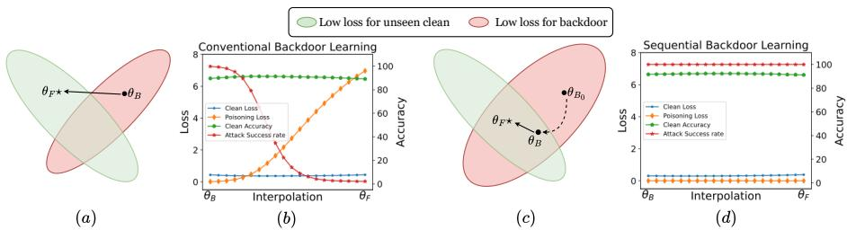
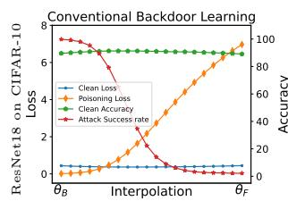
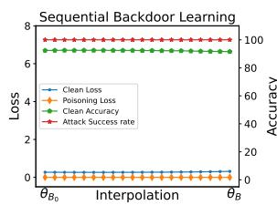
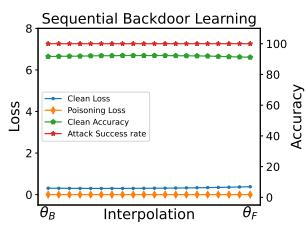
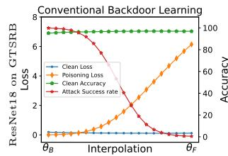
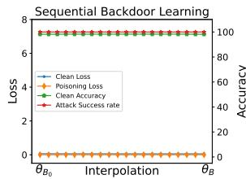
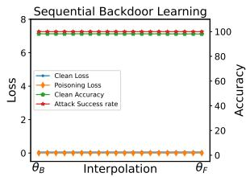
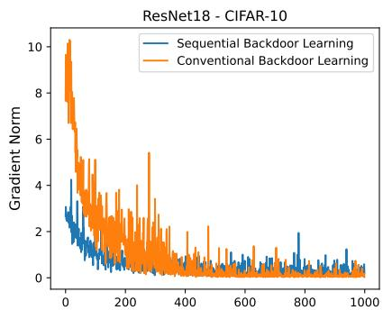
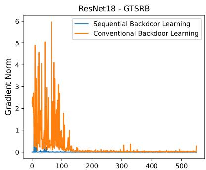

# Flatness-aware Sequential Learning Generates Resilient Backdoors

Hoang Pham $^ 1 \oplus$ , The-Anh Ta ${ \mathrm { ? } } \oplus$ , Anh Tran ${ } ^ { 3 } \oplus$ , and Khoa D. Doan $^ 1 \oplus$

1 College of Engineering and Computer Science, VinUniversity

2 CSIRO’s Data61 3 VinAI Research

hoang.pv1602@gmail.com, khoa.dd@vinuni.edu.vn

theanh.ta@csiro.au, v.anhtt152@vinai.io

Abstract. Recently, backdoor attacks have become an emerging threat to the security of machine learning models. From the adversary’s perspective, the implanted backdoors should be resistant to defensive algorithms, but some recently proposed fine-tuning defenses can remove these backdoors with notable efficacy. This is mainly due to the catastrophic forgetting (CF) property of deep neural networks. This paper counters CF of backdoors by leveraging continual learning (CL) techniques. We begin by investigating the connectivity between a backdoored and fine-tuned model in the loss landscape. Our analysis confirms that fine-tuning defenses, especially the more advanced ones, can easily push a poisoned model out of the backdoor regions, making it forget all about the backdoors. Based on this finding, we re-formulate backdoor training through the lens of CL and propose a novel framework, named Sequential Backdoor Learning (SBL), that can generate resilient backdoors. This framework separates the backdoor poisoning process into two tasks: the first task learns a backdoored model, while the second task, based on the CL principles, moves it to a backdoored region resistant to fine-tuning. We additionally propose to seek flatter backdoor regions via a sharpnessaware minimizer in the framework, further strengthening the durability of the implanted backdoor. Finally, we demonstrate the effectiveness of our method through extensive empirical experiments on several benchmark datasets in the backdoor domain. The source code is available at https://github.com/mail-research/SBL-resilient-backdoors

Keywords: Backdoor attack · Continual learning

# 1 Introduction

Swift progress in the field of machine learning (ML), especially within the realm of deep neural networks (DNNs), is revolutionizing various aspects of our daily lives across different domains and applications from computer vision to natural language processing tasks [5, 59, 60, 63, 70]. Unfortunately, as well-trained models are now considered valuable assets due to the significant computational resources, annotated data, and expertise spent to create them, they are becoming appealing targets for cyber attacks [6, 7, 44]. Prior studies have shown

that DNN models are vulnerable to diverse attacks, from exploratory attacks such as adversarial attacks [35, 58, 74] to causative attacks such as poisoning attacks [25,65] and backdoor attacks [24,53,56]. Among these, backdoor attacks have recently gained attention because of the increasing popularity of machine learning as a service (MLaaS), where a model user outsources model training to a more experienced ML service provider. In backdoor attacks, the adversary injects a backdoor into the poisoned model by either contaminating the training data [4, 10, 15, 24, 55, 56] or manipulating the training process [13, 14, 17, 21, 79]. This backdoored model is expected to behave normally on benign input, but give a specific output, defined by the attacker, when the backdoor trigger appears on any input. Consequently, the attacker can deceive the model user into integrating this poisoned model (with the hidden backdoor) into their systems to gain illegal benefits or cause harmful damages [23, 40, 54, 76].

  
Fig. 1: (a) Intuition for fine-tuning defense against conventional backdoor learning (CBL): the backdoored model $\theta _ { B }$ is pushed out of backdoor region (red area); (c) Intuition for the success of our sequential backdoor learning (SBL) framework: $\theta _ { B }$ is trapped within the backdoor region that is hard to escape with fine-tuning. Figure b and d visualize the loss and the accuracy on clean and poisoned test sets of intermediate models when linearly interpolating between backdoored and fine-tuned models with CBL and SBL.

As research on backdoor attacks advances, numerous defense strategies against such attacks have been introduced. These defenses can detect the poisoned model [20, 69], or remove the backdoors by knowledge distillation [31, 39], and pruning [43, 71]. While being effective, these methods pose utility (e.g., nontrivial drop in accuracy), and consistency (e.g., effectiveness dependent on network architectures) challenges [80]. Recently, fine-tuning defenses [43, 80] have shown promising performance in backdoor removals; furthermore, since the model user usually does not use a pre-trained model as-is but will adapt it for their problem, fine-tuning is likely a necessary step in many practical ML pipelines. In particular, the user can fine-tune a pre-trained model using a small clean dataset [43, 80], making it forget the implanted backdoor. As demonstrated in Figure (1b), when we linearly interpolate from the backdoored model (with conventional backdoor learning) to its corresponding fine-tuned model, the intermediate model’s poisoning loss (i.e., the loss recorded on the poisoned samples only) increases, resulting in the decrease in Attack Success Rate (ASR) accordingly.

Meanwhile, the corresponding clean loss and accuracy are stable. This indicates that fine-tuning with clean data can move the poisoned model to the clean-only region, explaining the effectiveness of existing fine-tuning defenses.

We take the perspective of the backdoor attackers and aim to investigate backdoors that are resilient to fine-tuning based defenses. Our starting point is the observation that the main reason for the effectiveness of fine-tuning defense is the catastrophic forgetting property of DNNs [40] when models are continuously trained on unseen clean data. The setting is then naturally connected to Continual Learning (CL) - the learning paradigm that focuses exactly on mitigating catastrophic forgetting [2, 9, 33]. Thus, to counter the use of forgetting to cleanse backdoors in fine-tuning defenses, our high-level idea is to leverage CL techniques to craft backdoors that are hard to forget.

Specifically, we design a novel sequential learning procedure for backdoor attack and propose a new framework, named SBL, for creating fine-tuning resistant backdoored models. SBL separates the backdoor learning process into two sequential tasks: the first task learns the backdoored model, while the second task simulates fine-tuning defense on this model with a small set of clean data. We augment the second task with CL techniques to guide the poisoned model towards a low-loss, backdoored minimum (from $\theta _ { B _ { 0 } }$ to $\theta _ { B }$ in Figure (1c)) where it is difficult for the defender to remove the backdoor with fine-tuning defenses.

We additionally seek for flat backdoor region that can intensify the backdoor eliminating challenge for a fine-tuning defense, further strengthening the durability of the implanted backdoor. Our goal is to trap the model in a flat backdoored area that is hard to escape. We demonstrate the effectiveness of our SBL in Figure (1d) revealing that as we interpolate linearly between the backdoored and the fine-tuned models, the poisoning loss and ASR remain largely constant. Meanwhile, the clean performance experiences a slight improvement along the connectivity path.

In summary, our main contributions are:

(i) We propose a novel backdoor learning framework, named SBL, which involves two sequential learning tasks, for generating resistant backdoored models. The framework is inspired by the empirical observation that existing fine-tuning defenses can effectively push the backdoored model to a backdoor-free region in the parameter space. Our learning framework can be used to train existing backdoor attacks, further improving their resistance against fine-tuning defenses.   
(ii) We propose to formulate the second task from the continual learning perspective. This involves applications of existing CL techniques and a flatnessaware minimization approach, both of which collaboratively strengthen the resistance of the backdoor.   
(iii) We perform extensive empirical experiments and analysis to demonstrate the effectiveness of the proposed framework in improving the durability of several existing backdoor attacks. This urges backdoor researchers to devise defensive measures to counter this type of attack.

# 2 Related Work

# 2.1 Backdoor Attacks

In backdoor attacks, the adversary aims to manipulate the output of the victim model to a specific target label with input having pre-defined triggers [11, 19, 41, 61]. The backdoor injection process can be done by poisoning data [10, 24] or maliciously implanting a backdoor during training [21, 79]. Gu et al [24] first investigated backdoor attacks in deep neural networks and proposed BadNets. It injects the trigger into a small random number of inputs in the training set and re-labels them into target labels. After that various backdoor attacks focus on designing the triggers. In particular, Chen et al [10] leverage image blending in design trigger while Barni et al [4] use sinusoidal strips. WaNet [55] trains a generator to create input-aware triggers. LIRA [13, 14] jointly learns trigger generator and victim model to launch imperceptible backdoor attacks. Besides data attacks, some works [21,79] perturb the weights of a pre-trained clean model to inject a backdoor.

# 2.2 Backdoor Defenses

In general, backdoor defense methods can be divided into pre-training [67, 69], in-training [38, 78], and post-training [31, 39, 43, 45, 80] stages. In pre-training and in-training defenses, the defender assumes the dataset is poisoned, and thus leverages the models’ distinct behavioral differences on the clean and poisoned samples to remove the manipulated data or avoid learning the backdoor during training. Most defensive solutions perform post-training defenses since it can be more challenging to alter or, in some cases, not possible to participate in the training process. Post-training defenses assume the defender has access to a small set of benign samples for backdoor removal [30, 39, 43, 71, 80] and can be roughly categorized into fine-tuning based defenses [39,43,80] and pruning-based defenses [8,43,71]. Pruning-based defenses prune neurons [43,71] or weights [8] to remove backdoor-contaminated components in the model. However, these methods either cause non-trivial drops in benign accuracy or their effectiveness depends on the network architectures [80], significantly reducing their utility and consistency. On the other hand, fine-tuning based defenses leverage the catastrophic forgetting phenomenon of DNNs [2, 33], when a backdoored model is fine-tuned on clean data, for backdoor removal. In addition, fine-tuning is also a common step in numerous practical ML systems to adapt a pre-trained model to better align with the user’s needs. This paper focuses on developing a novel backdoor learning approach that can enable existing backdoor attacks to be resistant to conventional fine-tuning processes in practical applications and advanced fine-tuning defenses.

# 2.3 Continual Learning

Continual Learning (CL) is a learning paradigm where the model learns a sequence of tasks. When tasks arrive, the model has to preserve previous knowledge

while efficiently learning new tasks, which is known as the stability-plasticity dilemma. There are three main approaches to dealing with this problem.

(i) Regularization approaches [1, 2, 33, 52, 68, 75] add explicit regularization terms to penalize the variation of each parameter using its “importance" in performing the old tasks.   
(ii) Architecture-based approaches [26,48,49,72,73] assign specific parameters for each task and even expand the base architecture when more parameters are required.   
(iii) Replay-based approaches [3, 9, 12, 47, 57] store a set of prior-task data and use the stored data together with new-task data when learning on new tasks.

Our method views backdoor attack and defense as a continual learning problem, where backdoor learning is the first task, and fine-tuning on clean, unseen data is another task.

# 2.4 Mode Connectivity and Sharpness-Aware Minimization

Loss landscape has been investigated to understand the behavior of DNNs [18, 22, 37]. Hochreiter et al [28] show that flat and wide minima generalize better than sharp minima. Recently, SAM [18] and its variants [36,46,77] improve generalization by simultaneously minimizing both the loss value and loss sharpness. This property is leveraged to mitigate forgetting in CL methods [12,51]. Besides, Mode Connectivity [16, 22], a novel tool to understand the loss landscape, postulates that different optima obtained by gradient-based optimization methods are connected by simple low-error path (i.e., low-loss valleys). Mirzadeh et al [50] observe that there exists a low-error path connecting multi-task and continual learning minima when they share a common starting point. Motivated by this observation, the works in [42, 50] propose methods to guide the model towards this connectivity region.

# 3 Methodology

# 3.1 Threat Model

We adopt the commonly-used backdoor-attack setting where the attacker trains a model and provides it to the victim [13, 40]. Since training large-scale neural networks is empirical, data-driven, and resource-extensive, it is generally costprohibitive for end-users, who consequently turn to third-party MLaaS platforms [62] for model training, or simply clone pre-trained models from public sources such as Hugging Face. This practice opens up opportunities for trainingcontrol backdoor attacks, a serious security threat to victim users.

Attacker’s Capability. The attacker has full control of designing the triggers, poisoning training data, and the model training schedule.

Attacker’s Goal. The attacker aims to implant a backdoor into the model and bypass post-training defense methods, especially fine-tuning defenses.

Defender’s Goal. Focusing on the recent fine-tuning defenses, we assume that the victim is given a pre-trained backdoored model, and has access to a small, clean dataset. The defender’s goal is to then fine-tune the model on the clean data to remove potentially hidden backdoors while adapting and maintaining the model’s performance on their data.

# 3.2 Conventional Backdoor Learning

We consider supervised learning of classification tasks where the objective is to learn a mapping function $f _ { \theta } : \mathcal { X }  \mathcal { C }$ with the input domain $\mathcal { X }$ and the set of class labels $\boldsymbol { \mathscr { C } }$ . The task is to learn the parameters $\theta$ from training dataset ${ \mathcal { D } } = \{ ( x _ { i } , y _ { i } ) : x _ { i } \in \mathcal { X } , y _ { i } \in \mathcal { C } , i = 1 , 2 , . . . , N \}$ using a standard classification loss $\mathcal { L }$ such as Cross-Entropy Loss. The most common training scheme for backdoor attacks uses data poisoning to implant backdoors, where the classifier is trained on $\mathcal { D } _ { p }$ - a mixture of clean and poisoned data from $\mathcal { D }$ . The general procedure to generate poisoned data is to transform a clean training sample $( x , y )$ into a backdoor sample $( T ( x ) , \eta ( y ) )$ with some backdoor injection function $T$ and target label function $\eta$ . Backdoor training manipulates the behavior of $f$ so that: $f ( x ) = y$ , $f ( T ( x ) ) = \eta ( y )$ .

It is well-established that such training can cause the models to converge to the backdoor regions. However, empirical evidence [43] (see also our Figure 2) suggests that even a simple fine-tuning process with a small set of clean data can lead the model to an alternative local minimum that is free of backdoor while preserving the model’s performance on clean data.

# 3.3 Proposed SBL Framework

This paper views backdoor learning through the lens of continual learning (CL): we re-formulate the attack and defense as the CL tasks. More precisely, the attacker aims to develop resilient backdoors that remain even after the models undergo fine-tuning defenses at the user’s site - this can be regarded as reducing catastrophic forgetting in CL; while the defender strives to relocate the models away from the backdoor region without compromising performance on clean data - leveraging catastrophic forgetting to remove backdoors.

To challenge the effectiveness of fine-tuning defenses, our key idea is to simulate this defense mechanism during the training phase of backdoor learning to familiarize our models with clean-data fine-tuning, which reduces the effect of forgetting during any subsequent fine-tuning defenses. In particular, we split the training data $\mathcal { D } _ { p }$ into two sets $\mathcal { D } _ { 0 }$ and $\mathcal { D } _ { 1 }$ , where $\mathcal { D } _ { 0 }$ is a combination of clean and poisoned data while $\mathcal { D } _ { 1 }$ contains only clean samples. Then, we divide backdoor training into two consecutive tasks: first to learn the backdoor, then familiarize it with fine-tuning. In the first step, we learn a backdoored model $\theta _ { B _ { 0 } }$ on $\mathcal { D } _ { 0 }$ by utilizing Sharpness-Aware Minimization (SAM) [18,36] on the loss $\mathcal { L } ^ { S A M } ( \mathcal { D } _ { 0 } ; \theta )$ . Since a flatter loss landscape is known to reduce catastrophic forgetting [12, 51], this training strategy will seek a flat backdoor loss landscape, consequently limiting the model’s ability to forget backdoor-related knowledge

during fine-tuning defenses with clean data. In the second step, we continue to train $\theta _ { B _ { 0 } }$ (found in Step 0) on $\mathcal { D } _ { 1 }$ with relatively small learning rate and the additional CL regularization to force the model to converge into a low clean loss basin but deeper within the backdoor’s effective area:

$$
\mathcal {L} _ {1} = \mathcal {L} \left(\mathcal {D} _ {1}; \theta\right) + \mathcal {R} \left(\theta_ {B _ {0}}, \theta\right) \tag {1}
$$

Algorithm 1 Sequential Backdoor Learning (SBL)

1: Input: Training data $\mathcal { D } _ { 0 }$ , $\mathcal { D } _ { 1 }$ , model’s parameters $\theta$   
2: Output: Backdoored model $\theta _ { B }$   
3: Initialize model parameter $\theta$   
4: Step 0: Learning the first task   
5: $\theta _ { B _ { 0 } } \gets \operatorname * { a r g m i n } _ { \theta } \mathcal { L } ^ { S A M } ( \mathcal { D } _ { 0 } ; \theta )$   
6: Step 1: Fine-tuning on clean data with constrains   
7: Set $\theta  \theta _ { B _ { 0 } }$   
8: $\theta _ { B } \gets \operatorname * { a r g m i n } _ { \theta } \mathcal { L } ( \mathcal { D } _ { 1 } ; \theta ) + \mathcal { R } ( \theta _ { B _ { 0 } } , \theta )$   
9: Return: θB

# 3.4 On the working mechanism of our method SBL

The proposed method SBL is designed based on our intuition that to neutralize the effect of fine-tuning defenses, we can train the model so that it converges to backdoored regions having flat loss landscapes. Flatness then can cause the finetuned model in Step 1 (usually with small learning rates) to still be trapped in the region of backdoor knowledge, which makes our attack resilient to fine-tuning defenses. Here, we provide further heuristic explanations based on observations from continual learning and mode connectivity, and confirm with empirical evidence that the behaviors of our approach closely align with these intuitions. Additional analysis in terms of Taylor expansions is given in the Appendix.

We regard the Algorithm 1 of SBL as a two-step procedure: multi-task (MT) training (Step 0) followed by continual learning (CL) (Step 1). More precisely, SBL first trains the backdoored model $\theta _ { B _ { 0 } }$ on both clean and poisoned data (MT), then fine-tunes $\theta _ { B _ { 0 } }$ with clean data and a tiny learning rate to obtain $\theta _ { B }$ (CL). Denote $\theta _ { F }$ the model obtained with a fine-tuning defense afterward.

First, we calculate the losses and accuracies of models trained with SBL along various connectivity paths and compare them to those obtained with conventional backdoor learning (CBL) models. We perform experiments on two settings: ResNet18 model on CIFAR-10 and GTSRB, with BadNets as the base attack. In Figure 2, the first column visualizes the loss and accuracy on the clean and poisoned test sets, where we linearly interpolate between a backdoored and fine-tuned model in the CBL setup. While the clean loss and accuracy remain unchanged, the poison loss gradually increases and the corresponding ASR decreases to nearly zero on the fine-tuned model. This indicates that with CBL, fine-tuning can effectively push the poisoned model out of the backdoor-affected area. On the other hand, the persistently high ASR and low poison losses in

the third column of Figure 2 (interpolations between $\theta _ { B }$ and $\theta _ { F }$ ) show that our SBL method can trap backdoored model in backdoored region that is difficult to escape from.

Recent works [42,50] have established that there are low-error pathways connecting minima of MT solutions and CL solutions. In SBL, Step 1 is designed to seek a low-error path to guide our model to a flat backdoored solution. Empirically, we observe in Figure 2 that SBL can identify low-error pathways connecting multi-task model ( $\theta _ { B _ { 0 } }$ ) to continual learning model (θB) (the second column), and from $\theta _ { B }$ to the fine-tuned model (θF ) (the third column). In addition, we empirically show in Figure 3 that gradients’ norm during fine-tuning defense on clean data remains small, which directly mitigates the forgetting of backdoor knowledge.

  
Fig. 2: The loss and the accuracy on clean and poisoned test sets of intermediate models when linearly interpolating between models. The first column is between backdoored and fine-tuned models in conventional backdoor learning, the second column is between models in the first ( $\theta _ { B _ { 0 } }$ ) and second task ( $\theta _ { B }$ ), while the last column is between backdoored and fine-tuned models in our SBL framework.

# 4 Experiments

# 4.1 Experiment Setting

Datasets. We use three benchmark datasets in backdoor research, namely CIFAR-10 [34], GTSRB [29], and ImageNet-10 for the experiments. We follow [32] to select 10 classes from ImageNet-1K [64]. We divide the training set into three subsets: mixed set $\mathcal { D } _ { 0 }$ (poisoned and benign samples), clean set $\mathcal { D } _ { 1 }$ , and defense set with portion 85% - 10% - 5%, respectively.

Models. We use the same classifier backbone ResNet18 [27] for all datasets. We also employ different architectures (in ablation studies): VGG-16 [66] and ResNet-20, a lightweight version of ResNet. We use SGD optimizer for training

the backdoored model and SAM [18] for training the first task. We set the learning rate to 0.01 in the first task and 0.001 in the second task. We train the backdoored model for 150 epochs in Step 0 and for 100 epochs in Step 1.

Backdoor Attacks. We consider representative backdoor attacks, including BadNets [24], Blended [10], SIG [4], and Dynamic [55]. For BadNets, we use a random-color, $3 \times 3$ square at the bottom right corner as the backdoor trigger on all datasets. We use pre-trained generators from [55] to generate poisoned images for Dynamic Attack. In all experiments, we poison $1 0 \%$ of training data and set the targeted class to label 0.

Defense Methods. We evaluate the persistence of the backdoored models against fine-tuning-based defenses, including standard finetuning [43] and the advanced finetuning approaches, SAM-FT [80] and NAD [39]. For standard finetuning, we use SGD with two learning rates 0.01 and 0.005; similarly, for SAM-FT, we set the learning rate to 0.005. We fine-tune these models for 50 epochs. For NAD, we fine-tune the teacher and student using a learning rate of 0.01 for 20 epochs.

Backdoor Training Methods. Here, along with original backdoor training, we select several CL techniques to incorporate into our SBL framework to train backdoored models including Naive, EWC [33], Anchoring [79], and AGEM [9].

Evaluation Metrics. We use two common metrics to evaluate the performance of the backdoored models: Clean Accuracy (CA) to measure the performance on benign samples and Attack Success Rate (ASR) to measure the proportion of backdoor samples that are successfully misclassified to the targeted label.

Additional experimental details are provided in Appendix.

# 4.2 Backdoor Performance

We verify the effectiveness of SBL by comparing it against the standard backdoor training using different fine-tuning defenses. We conduct the experiments on three datasets, including CIFAR-10, GTSRB, and Imagenet-10 with 10% poisoning rate, and with ResNet18. In Step 1, we train the backdoored model $\theta _ { B _ { 0 } }$ obtained in Step 0 with different CL methods. The results are presented in Table 1, 2, and 3, respectively. Due to the space limit, we present the SBL’s experiments with Anchoring in the Appendix.

In the CIFAR-10 and GTSRB settings, for conventional backdoor training, fine-tuning with a lower learning rate (0.005) can better preserve the model’s utility but fails to effectively mitigate the backdoor. In contrast, fine-tuning with a larger learning rate (0.01) can effectively eliminate backdoors but comes at the cost of sacrificing clean-data performance. Both FT-SAM and NAD can maintain high clean accuracy while effectively mitigating backdoors. On the other hand, SBL significantly enhances the backdoor’s resilience against all the previously mentioned defensive methods. With different CL techniques, SBL effectively circumvents these defenses.

In the case of ImageNet-10, although fine-tuning defenses with learning rates in our setting successfully eliminate the effect of backdoors in Original baselines, it has to sacrifice the model’s utility. Learning backdoored model via SBL can significantly improve the resistance against these fine-tuning defenses, most of them still achieve at least 60% ASR while the CA is almost above 70%. We attribute this improvement to the effect of flat minima discovered by our SBL.

Table 1: The resilience against fine-tuning defenses in setting ResNet18 on CIFAR-10.   

<table><tr><td rowspan="2">Attack</td><td rowspan="2">Training</td><td colspan="2">Step 0</td><td colspan="2">Step 1</td><td colspan="2">FT SGD-0.005</td><td colspan="2">FT SGD-0.01</td><td colspan="2">NAD</td><td colspan="2">FT-SAM</td></tr><tr><td>CA</td><td>ASR</td><td>CA</td><td>ASR</td><td>CA</td><td>ASR</td><td>CA</td><td>ASR</td><td>CA</td><td>ASR</td><td>CA</td><td>ASR</td></tr><tr><td rowspan="4">Badnets</td><td>Original</td><td></td><td></td><td>91.54</td><td>99.64</td><td>90.17</td><td>14.08</td><td>88.68</td><td>1.79</td><td>89.19</td><td>1.21</td><td>90.25</td><td>2.50</td></tr><tr><td>SBL w. Naive</td><td>92.58</td><td>100</td><td>91.64</td><td>100</td><td>91.64</td><td>100</td><td>91.43</td><td>100</td><td>91.43</td><td>100</td><td>91.52</td><td>100</td></tr><tr><td>SBL w. EWC</td><td>92.58</td><td>100</td><td>92.09</td><td>100</td><td>91.90</td><td>100</td><td>91.68</td><td>100</td><td>91.55</td><td>100</td><td>91.75</td><td>100</td></tr><tr><td>SBL w. AGEM</td><td>92.58</td><td>100</td><td>92.22</td><td>100</td><td>91.90</td><td>100</td><td>91.67</td><td>100</td><td>91.62</td><td>100</td><td>91.74</td><td>100</td></tr><tr><td rowspan="4">Blended</td><td>Original</td><td></td><td></td><td>91.62</td><td>100</td><td>91.07</td><td>58.30</td><td>89.79</td><td>8.48</td><td>89.50</td><td>22.29</td><td>90.60</td><td>33.13</td></tr><tr><td>SBL w. Naive</td><td>91.91</td><td>100</td><td>91.23</td><td>100</td><td>91.25</td><td>100</td><td>91.10</td><td>100</td><td>91.19</td><td>100</td><td>91.09</td><td>100</td></tr><tr><td>SBL w. EWC</td><td>91.91</td><td>100</td><td>91.80</td><td>100</td><td>91.78</td><td>100</td><td>91.56</td><td>100</td><td>91.44</td><td>99.98</td><td>91.51</td><td>100</td></tr><tr><td>SBL w. AGEM</td><td>91.91</td><td>100</td><td>91.86</td><td>100</td><td>91.80</td><td>100</td><td>91.54</td><td>100</td><td>91.53</td><td>99.98</td><td>91.55</td><td>100</td></tr><tr><td rowspan="4">SIG</td><td>Original</td><td></td><td></td><td>91.22</td><td>99.94</td><td>91.46</td><td>0.57</td><td>89.59</td><td>0.38</td><td>90.07</td><td>0.57</td><td>90.22</td><td>0.51</td></tr><tr><td>SBL w. Naive</td><td>92.09</td><td>99.96</td><td>91.29</td><td>99.06</td><td>91.03</td><td>99.93</td><td>91.06</td><td>95.98</td><td>91.00</td><td>96.97</td><td>90.96</td><td>97.94</td></tr><tr><td>SBL w. EWC</td><td>92.09</td><td>99.96</td><td>91.81</td><td>99.38</td><td>91.63</td><td>99.29</td><td>91.69</td><td>97.96</td><td>91.63</td><td>97.61</td><td>91.73</td><td>99.28</td></tr><tr><td>SBL w. AGEM</td><td>92.09</td><td>99.96</td><td>91.91</td><td>99.16</td><td>91.61</td><td>98.19</td><td>91.66</td><td>97.94</td><td>91.59</td><td>97.17</td><td>91.71</td><td>99.23</td></tr><tr><td rowspan="4">Dynamic</td><td>Original</td><td></td><td></td><td>91.15</td><td>99.96</td><td>91.16</td><td>23.58</td><td>89.91</td><td>6.93</td><td>89.65</td><td>5.51</td><td>90.26</td><td>13.79</td></tr><tr><td>SBL w. Naive</td><td>91.96</td><td>99.94</td><td>91.35</td><td>99.49</td><td>91.63</td><td>100</td><td>91.73</td><td>99.89</td><td>91.64</td><td>99.85</td><td>91.22</td><td>99.89</td></tr><tr><td>SBL w. EWC</td><td>91.96</td><td>99.94</td><td>91.49</td><td>99.99</td><td>91.38</td><td>99.94</td><td>91.24</td><td>99.94</td><td>91.47</td><td>99.94</td><td>91.29</td><td>99.85</td></tr><tr><td>SBL w. AGEM</td><td>91.96</td><td>99.94</td><td>91.81</td><td>100</td><td>91.54</td><td>100</td><td>91.69</td><td>99.89</td><td>91.54</td><td>99.99</td><td>91.30</td><td>99.99</td></tr></table>

Qualitative Analysis of SBL’s Effectiveness. To explain how the backdoors implanted by SBL can evade fine-tuning defenses, we examine the gradients’ norm during the fine-tuning process for both CBL’s and SBL’s backdoored models. Figure 3 shows the gradient norms of ResNet18 on CIFAR-10 and GT-SRB. We can observe that in the early stage of fine-tuning, the gradient norm values of CBL are substantially higher than those of SBL. Higher values suggest that the fine-tuned model can more easily be pushed further away from the backdoored minimum, making it easier for the fine-tuning defenses to find backdoor-free local minima.

# 4.3 Ablation Studies

Architecture Ablation. We evaluate SBL’s effectiveness on different network architectures, including VGG-16 and ResNet-20 (a lightweight version of ResNet). The experiments are conducted on CIFAR-10 and GTSRB with various attacks while SBL uses EWC. Tables 4 and 5 show the backdoor’s performance against various fine-tuning defenses. We observe similar effectiveness in SBL with these network architectures, confirming that SBL can successfully enhance the durability of the backdoored models against finetuning defenses.

Role of Continual Learning. As discussed in Section 3.3, the CL design of SBL helps learn a backdoored model that is resistant to catastrophic forgetting

Table 2: The resilience against fine-tuning defenses in setting ResNet18 on GTSRB.   

<table><tr><td rowspan="2">Attack</td><td rowspan="2">Training</td><td colspan="2">Step 0</td><td colspan="2">Step 1</td><td colspan="2">FT SGD-0.005</td><td colspan="2">FT SGD-0.01</td><td colspan="2">NAD</td><td colspan="2">FT-SAM</td></tr><tr><td>CA</td><td>ASR</td><td>CA</td><td>ASR</td><td>CA</td><td>ASR</td><td>CA</td><td>ASR</td><td>CA</td><td>ASR</td><td>CA</td><td>ASR</td></tr><tr><td rowspan="4">Badnets</td><td>Original</td><td></td><td></td><td>96.62</td><td>99.99</td><td>97.30</td><td>93.31</td><td>97.21</td><td>3.09</td><td>97.17</td><td>1.03</td><td>97.36</td><td>0.20</td></tr><tr><td>SBL w. Naive</td><td>98.15</td><td>100</td><td>97.99</td><td>100</td><td>97.65</td><td>100</td><td>97.24</td><td>100</td><td>96.59</td><td>100</td><td>98.21</td><td>100</td></tr><tr><td>SBL w. EWC</td><td>98.15</td><td>100</td><td>98.12</td><td>100</td><td>98.04</td><td>100</td><td>98.04</td><td>100</td><td>97.95</td><td>100</td><td>98.34</td><td>100</td></tr><tr><td>SBL w. AGEM</td><td>98.15</td><td>100</td><td>98.16</td><td>100</td><td>98.04</td><td>100</td><td>98.04</td><td>100</td><td>97.95</td><td>100</td><td>98.25</td><td>100</td></tr><tr><td rowspan="4">Blended</td><td>Original</td><td></td><td></td><td>96.71</td><td>99.97</td><td>97.19</td><td>52.74</td><td>96.46</td><td>1.86</td><td>96.15</td><td>0.15</td><td>95.44</td><td>7.12</td></tr><tr><td>SBL w. Naive</td><td>98.32</td><td>100</td><td>98.27</td><td>100</td><td>98.13</td><td>100</td><td>97.81</td><td>100</td><td>97.84</td><td>99.84</td><td>98.31</td><td>100</td></tr><tr><td>SBL w. EWC</td><td>98.32</td><td>100</td><td>98.12</td><td>100</td><td>98.21</td><td>100</td><td>98.31</td><td>100</td><td>98.21</td><td>100</td><td>98.44</td><td>100</td></tr><tr><td>SBL w. AGEM</td><td>98.32</td><td>100</td><td>98.21</td><td>100</td><td>98.22</td><td>100</td><td>98.31</td><td>100</td><td>98.21</td><td>100</td><td>98.42</td><td>100</td></tr><tr><td rowspan="4">SIG</td><td>Original</td><td></td><td></td><td>96.47</td><td>99.99</td><td>95.95</td><td>2.86</td><td>93.41</td><td>0.14</td><td>94.71</td><td>0</td><td>95.47</td><td>1.29</td></tr><tr><td>SBL w. Naive</td><td>98.27</td><td>100</td><td>98.23</td><td>99.99</td><td>97.88</td><td>99.99</td><td>97.67</td><td>99.92</td><td>96.41</td><td>98.53</td><td>98.12</td><td>100</td></tr><tr><td>SBL w. EWC</td><td>98.27</td><td>100</td><td>98.14</td><td>100</td><td>98.15</td><td>100</td><td>98.13</td><td>100</td><td>98.17</td><td>100</td><td>98.11</td><td>100</td></tr><tr><td>SBL w. AGEM</td><td>98.27</td><td>100</td><td>98.19</td><td>100</td><td>98.15</td><td>100</td><td>98.14</td><td>100</td><td>98.17</td><td>100</td><td>98.12</td><td>100</td></tr><tr><td rowspan="4">Dynamic</td><td>Original</td><td></td><td></td><td>96.17</td><td>99.98</td><td>96.66</td><td>0.15</td><td>95.23</td><td>0.02</td><td>57.43</td><td>0.01</td><td>97.09</td><td>0.06</td></tr><tr><td>SBL w. Naive</td><td>98.37</td><td>100</td><td>98.32</td><td>99.92</td><td>98.06</td><td>100</td><td>98.04</td><td>100</td><td>98.05</td><td>100</td><td>98.19</td><td>100</td></tr><tr><td>SBL w. EWC</td><td>98.37</td><td>100</td><td>98.23</td><td>100</td><td>98.08</td><td>100</td><td>90.02</td><td>100</td><td>98.04</td><td>100</td><td>98.21</td><td>100</td></tr><tr><td>SBL w. AGEM</td><td>98.37</td><td>100</td><td>98.22</td><td>100</td><td>98.08</td><td>100</td><td>98.03</td><td>100</td><td>98.01</td><td>100</td><td>98.20</td><td>100</td></tr></table>

Table 3: The resilient against fine-tuning defenses in setting ResNet18 on ImageNet-10.   

<table><tr><td rowspan="2">Attack</td><td rowspan="2">Training</td><td colspan="2">Step 0</td><td colspan="2">Step 1</td><td colspan="2">FT SGD-0.005</td><td colspan="2">FT SGD-0.01</td><td colspan="2">NAD</td><td colspan="2">FT-SAM</td></tr><tr><td>CA</td><td>ASR</td><td>CA</td><td>ASR</td><td>CA</td><td>ASR</td><td>CA</td><td>ASR</td><td>CA</td><td>ASR</td><td>CA</td><td>ASR</td></tr><tr><td rowspan="4">Badnets</td><td>Original</td><td></td><td></td><td>89.65</td><td>99.36</td><td>73.27</td><td>6.71</td><td>51.38</td><td>10.47</td><td>41.03</td><td>5.23</td><td>37.08</td><td>6.79</td></tr><tr><td>SBL w. Naive</td><td>89.46</td><td>99.91</td><td>88.65</td><td>99.83</td><td>85.69</td><td>91.54</td><td>76.96</td><td>70.43</td><td>69.77</td><td>73.68</td><td>83.08</td><td>84.96</td></tr><tr><td>SBL w. EWC</td><td>89.46</td><td>99.91</td><td>89.15</td><td>100</td><td>87.08</td><td>99.83</td><td>85.19</td><td>76.54</td><td>73.69</td><td>74.03</td><td>83.62</td><td>86.28</td></tr><tr><td>SBL w. AGEM</td><td>89.46</td><td>99.91</td><td>89.31</td><td>100</td><td>87.27</td><td>99.96</td><td>83.12</td><td>75.64</td><td>70.23</td><td>71.07</td><td>83.04</td><td>87.95</td></tr><tr><td rowspan="4">Blended</td><td>Original</td><td></td><td></td><td>89.12</td><td>99.70</td><td>72.35</td><td>2.91</td><td>59.00</td><td>6.88</td><td>44.92</td><td>12.65</td><td>66.08</td><td>1.41</td></tr><tr><td>SBL w. Naive</td><td>88.5</td><td>98.8</td><td>86.23</td><td>95.78</td><td>84.85</td><td>79.10</td><td>78.62</td><td>59.48</td><td>72.16</td><td>64.53</td><td>79.46</td><td>36.41</td></tr><tr><td>SBL w. EWC</td><td>88.5</td><td>98.8</td><td>88.12</td><td>97.35</td><td>86.23</td><td>81.67</td><td>81.88</td><td>74.06</td><td>76.38</td><td>73.42</td><td>82.96</td><td>46.79</td></tr><tr><td>SBL w. AGEM</td><td>88.5</td><td>98.8</td><td>88.31</td><td>97.74</td><td>86.19</td><td>82.35</td><td>83.85</td><td>69.02</td><td>74.88</td><td>70.3</td><td>81.73</td><td>62.95</td></tr><tr><td rowspan="4">SIG</td><td>Original</td><td></td><td></td><td>89.27</td><td>99.87</td><td>75.38</td><td>1.67</td><td>55.50</td><td>7.82</td><td>48.92</td><td>11.37</td><td>63.31</td><td>5.00</td></tr><tr><td>SBL w. Naive</td><td>89.5</td><td>99.83</td><td>85.69</td><td>94.27</td><td>85.58</td><td>69.15</td><td>80.38</td><td>60.81</td><td>66.31</td><td>45.21</td><td>82.50</td><td>73.89</td></tr><tr><td>SBL w. EWC</td><td>89.5</td><td>99.83</td><td>89.23</td><td>99.83</td><td>87.38</td><td>97.56</td><td>83.00</td><td>76.79</td><td>74.62</td><td>57.74</td><td>81.38</td><td>88.29</td></tr><tr><td>SBL w. AGEM</td><td>89.5</td><td>99.83</td><td>89.23</td><td>99.83</td><td>87.35</td><td>97.61</td><td>82.92</td><td>76.84</td><td>70.92</td><td>70.17</td><td>80.81</td><td>87.35</td></tr></table>

Table 4: Ablation study on different architectures with CIFAR-10 dataset.   

<table><tr><td rowspan="2">CIFAR-10</td><td rowspan="2">Training</td><td colspan="2">No Defense</td><td colspan="2">FT SGD-0.01</td><td colspan="2">NAD</td><td colspan="2">FT-SAM</td></tr><tr><td>CA</td><td>ASR</td><td>CA</td><td>ASR</td><td>CA</td><td>ASR</td><td>CA</td><td>ASR</td></tr><tr><td rowspan="6">ResNet-20</td><td>Badnets</td><td>86.15</td><td>99.99</td><td>85.49</td><td>3.51</td><td>85.07</td><td>2.21</td><td>84.36</td><td>12.19</td></tr><tr><td>Badnets w. SBL</td><td>87.78</td><td>99.99</td><td>86.96</td><td>99.44</td><td>86.84</td><td>99.74</td><td>86.74</td><td>98.93</td></tr><tr><td>Blended</td><td>87.08</td><td>99.9</td><td>86.42</td><td>52.07</td><td>86.19</td><td>25.52</td><td>85.61</td><td>39.98</td></tr><tr><td>Blended w. SBL</td><td>87.77</td><td>99.98</td><td>87.21</td><td>96.39</td><td>86.83</td><td>96.12</td><td>86.88</td><td>96.06</td></tr><tr><td>SIG</td><td>86.60</td><td>99.93</td><td>85.92</td><td>1.18</td><td>84.73</td><td>0.18</td><td>84.73</td><td>1.21</td></tr><tr><td>SIG w. SBL</td><td>87.82</td><td>98.92</td><td>86.98</td><td>88.77</td><td>86.99</td><td>90.79</td><td>87.33</td><td>88.89</td></tr><tr><td rowspan="6">VGG-16</td><td>Badnets</td><td>88.04</td><td>99.97</td><td>86.93</td><td>3.20</td><td>86.2</td><td>1.88</td><td>88.12</td><td>1.34</td></tr><tr><td>Badnets w. SBL</td><td>90.19</td><td>100</td><td>89.04</td><td>100</td><td>89.18</td><td>100</td><td>88.99</td><td>100</td></tr><tr><td>Blended</td><td>89.38</td><td>99.98</td><td>88.15</td><td>9.73</td><td>87.19</td><td>16.72</td><td>88.33</td><td>11.74</td></tr><tr><td>Blended w. SBL</td><td>90.63</td><td>100</td><td>90.12</td><td>100</td><td>90.13</td><td>100</td><td>90.25</td><td>100</td></tr><tr><td>SIG</td><td>88.26</td><td>98.88</td><td>87.55</td><td>0.70</td><td>86.29</td><td>0.41</td><td>88.87</td><td>1.39</td></tr><tr><td>SIG w. SBL</td><td>90.16</td><td>99.99</td><td>90.10</td><td>99.98</td><td>90.12</td><td>99.99</td><td>90.13</td><td>99.97</td></tr></table>

  
Fig. 3: Gradient norm comparison between conventional backdoor learning and our framework during defense fine-tuning with SGD-0.01 from the backdoored model.

Table 5: Ablation study on different architectures with GTSRB dataset.   

<table><tr><td rowspan="2">GTSRB</td><td rowspan="2">Training</td><td colspan="2">No Defense</td><td colspan="2">FT SGD-0.01</td><td colspan="2">NAD</td><td colspan="2">FT-SAM</td></tr><tr><td>CA</td><td>ASR</td><td>CA</td><td>ASR</td><td>CA</td><td>ASR</td><td>CA</td><td>ASR</td></tr><tr><td rowspan="6">ResNet-20</td><td>Badnets</td><td>95.96</td><td>100</td><td>95.87</td><td>1.36</td><td>95.93</td><td>0</td><td>94.96</td><td>0.06</td></tr><tr><td>Badnets w. SBL</td><td>97.23</td><td>100</td><td>97.06</td><td>100</td><td>97.07</td><td>100</td><td>97.21</td><td>100</td></tr><tr><td>Blended</td><td>95.70</td><td>99.89</td><td>95.67</td><td>47.22</td><td>95.69</td><td>73.54</td><td>92.91</td><td>85.86</td></tr><tr><td>Blended w. SBL</td><td>97.14</td><td>100</td><td>96.94</td><td>100</td><td>96.97</td><td>100</td><td>97.43</td><td>99.92</td></tr><tr><td>SIG</td><td>96.32</td><td>99.89</td><td>94.76</td><td>6.23</td><td>95.19</td><td>11.15</td><td>93.52</td><td>40.52</td></tr><tr><td>SIG w. SBL</td><td>96.74</td><td>99.99</td><td>96.92</td><td>99.98</td><td>97.05</td><td>99.98</td><td>96.98</td><td>99.98</td></tr><tr><td rowspan="6">VGG-16</td><td>Badnets</td><td>96.24</td><td>100</td><td>95.50</td><td>3.80</td><td>94.57</td><td>3.22</td><td>95.96</td><td>4.61</td></tr><tr><td>Badnets w. SBL</td><td>97.58</td><td>100</td><td>97.47</td><td>100</td><td>97.52</td><td>100</td><td>97.46</td><td>100</td></tr><tr><td>Blended</td><td>96.25</td><td>100</td><td>95.15</td><td>17.06</td><td>93.37</td><td>6.48</td><td>96.00</td><td>21.34</td></tr><tr><td>Blended w. SBL</td><td>97.17</td><td>100</td><td>97.12</td><td>100</td><td>97.25</td><td>100</td><td>97.68</td><td>100</td></tr><tr><td>SIG</td><td>96.71</td><td>99.98</td><td>94.69</td><td>0.62</td><td>93.64</td><td>7.10</td><td>95.46</td><td>64.18</td></tr><tr><td>SIG w. SBL</td><td>96.90</td><td>100</td><td>96.98</td><td>100</td><td>96.96</td><td>100</td><td>97.46</td><td>100</td></tr></table>

of backdoor knowledge in a subsequent fine-tuning process. To validate the importance of CL, we study the effectiveness of SBL with different CL techniques, including Naive, EWC, Anchoring, and AGEM, but without SAM on CIFAR-10 and GTSRB. We present the results with BadNets attack in Table 6. As can be observed, leveraging CL can improve the resistance of a backdoored model against SGD-finetuning or NAD, compared to conventional training. Specifically, during learning the second task with benign samples, while naive fine-tuning (Naive) can increase the durability of the backdoor, fine-tuning with CL exhibits significantly better resistance. On FT-SAM, however, the backdoors fail to persist. A possible explanation for the effectiveness of FT-SAM is that backdoor training with normal optimizers (e.g., SGD, Adam) creates backdoor-related neurons with high weights’ norms [80], and FT-SAM additionally leverages SAM in its fine-tuning process to shrink the norms of these backdoor-related neurons.

Role of Sharpness-Aware Minimizer. In SBL, SAM is utilized to guide the backdoored model towards flat backdoor regions, which helps mitigate catas-

Table 6: Ablation study on the role of Continual Learning with BadNets.   

<table><tr><td rowspan="2">BadNets</td><td rowspan="2">Training w/o SAM</td><td colspan="2">Step 0</td><td colspan="2">Step 1</td><td colspan="2">FT-SGD 0.005</td><td colspan="2">FT-SGD 0.01</td><td colspan="2">NAD</td><td colspan="2">FT-SAM</td></tr><tr><td>CA</td><td>ASR</td><td>CA</td><td>ASR</td><td>CA</td><td>ASR</td><td>CA</td><td>ASR</td><td>CA</td><td>ASR</td><td>CA</td><td>ASR</td></tr><tr><td rowspan="5">CIFAR-10</td><td>Original</td><td></td><td></td><td>91.54</td><td>99.64</td><td>90.17</td><td>14.08</td><td>88.68</td><td>1.79</td><td>89.19</td><td>1.21</td><td>90.25</td><td>2.5</td></tr><tr><td>Naive</td><td>90.2</td><td>100</td><td>91.66</td><td>99.99</td><td>91.46</td><td>93.71</td><td>91.21</td><td>23.19</td><td>90.88</td><td>42.22</td><td>91.51</td><td>2.84</td></tr><tr><td>EWC</td><td>90.2</td><td>100</td><td>91.69</td><td>99.99</td><td>91.36</td><td>96.31</td><td>91.01</td><td>40.52</td><td>90.84</td><td>80</td><td>91.27</td><td>6.13</td></tr><tr><td>Anchoring</td><td>90.2</td><td>100</td><td>91.65</td><td>99.99</td><td>91.46</td><td>99.58</td><td>91.15</td><td>85.73</td><td>91.06</td><td>58.39</td><td>91.22</td><td>9.34</td></tr><tr><td>AGEM</td><td>90.2</td><td>100</td><td>91.6</td><td>99.89</td><td>91.43</td><td>97.64</td><td>91.18</td><td>50.91</td><td>91.2</td><td>74.08</td><td>91.27</td><td>13.6</td></tr><tr><td rowspan="5">GTSRB</td><td>Original</td><td></td><td></td><td>96.62</td><td>99.99</td><td>97.3</td><td>93.31</td><td>97.21</td><td>3.09</td><td>97.17</td><td>1.03</td><td>97.36</td><td>0.2</td></tr><tr><td>Naive</td><td>96.43</td><td>99.96</td><td>98.01</td><td>99.74</td><td>98.08</td><td>87.02</td><td>98.06</td><td>42.89</td><td>98.1</td><td>87.5</td><td>98.17</td><td>0.25</td></tr><tr><td>EWC</td><td>96.43</td><td>99.96</td><td>98.01</td><td>99.85</td><td>98.08</td><td>97.56</td><td>98.23</td><td>86.65</td><td>98.04</td><td>95.43</td><td>97.8</td><td>0.42</td></tr><tr><td>Anchoring</td><td>96.43</td><td>99.96</td><td>97.81</td><td>99.99</td><td>98.06</td><td>95.59</td><td>98.1</td><td>92.63</td><td>98.07</td><td>96.49</td><td>98.16</td><td>16.5</td></tr><tr><td>AGEM</td><td>96.43</td><td>99.96</td><td>98.03</td><td>98.76</td><td>98.08</td><td>99.38</td><td>98.15</td><td>94.25</td><td>98.12</td><td>98.53</td><td>97.88</td><td>1.61</td></tr></table>

trophic forgetting of backdoors. We investigate the effectiveness of SAM training by utilizing it in both conventional backdoor training (CBL) and our framework. The results are reported in Table 7. As can be observed, the use of SAM can enhance the durability of the backdoored models, even when combined with standard backdoor training but only in some cases. The use of SAM in SBL, however, exhibits consistent backdoor durability against all fine-tuning defenses.

Table 7: Ablation study on the role of SAM with ResNet-18 on CIFAR-10 setting.   

<table><tr><td rowspan="2">Attack</td><td rowspan="2">BadNets</td><td colspan="2">No Defense</td><td colspan="2">FT SGD 0.005</td><td colspan="2">FT SGD 0.01</td><td colspan="2">NAD</td><td colspan="2">FT-SAM</td></tr><tr><td>CA</td><td>ASR</td><td>CA</td><td>ASR</td><td>CA</td><td>ASR</td><td>CA</td><td>ASR</td><td>CA</td><td>ASR</td></tr><tr><td rowspan="2">CBL</td><td>w. SAM</td><td>90.20</td><td>100</td><td>87.59</td><td>28.6</td><td>88.22</td><td>3.14</td><td>89.10</td><td>0.72</td><td>90.49</td><td>99.99</td></tr><tr><td>w/o SAM</td><td>91.54</td><td>99.64</td><td>90.17</td><td>14.08</td><td>88.68</td><td>1.79</td><td>89.19</td><td>1.21</td><td>90.25</td><td>2.5</td></tr><tr><td rowspan="2">SBL w. EWC</td><td>w. SAM</td><td>92.09</td><td>100</td><td>91.90</td><td>100</td><td>91.68</td><td>100</td><td>91.55</td><td>100</td><td>91.75</td><td>100</td></tr><tr><td>w/o SAM</td><td>91.69</td><td>99.99</td><td>91.36</td><td>96.31</td><td>91.01</td><td>40.52</td><td>90.84</td><td>80</td><td>91.27</td><td>6.13</td></tr></table>

Ablation on learning the second task. To further understand the role of learning the second task, we investigate the impact of the learning rate on this process. We conduct experiments on CIFAR-10 with ResNet18, while BadNets is the poisoning technique; we vary the value of the learning rate from 0.0005 to 0.01. In Table 8, we observe that, with smaller learning rates (<0.01) in Step 1, the backdoored model can effectively circumvent the fine-tuning based defenses. However, with larger learning rates, naively learning the second task will make it similar to the process of fine-tuning defense, resulting in a significant drop in ASR after the second task and the defense phase. On the other hand, EWC remains effective in preventing the backdoor from being forgotten after learning the second task and the fine-tuning defense. However, this effectiveness comes at the cost of compromising clean performance. This experiment highlights the role of small learning rates and the effect of CL methods, in particular EWC, in mitigating backdoor forgetting.

Ablation on poisoning rate. Here, we perform ablation studies on the poisoning rate to understand the effectiveness of our SBL framework in generating resilient backdoored models. In the previous experiments, we poisoned 10% of the training data; in the new experiments, we reduced this poisoning ratio to 5%

Table 8: The performance of backdoored model with different learning rates in the second task when training in Step 1 from $\theta _ { B _ { 0 } }$ to $\theta _ { B }$ on CIFAR-10 with ResNet18.   

<table><tr><td rowspan="2">Step 1 LR</td><td rowspan="2">Training</td><td colspan="2">Step 0</td><td colspan="2">Step 1</td><td colspan="2">FT SGD-0.01</td></tr><tr><td>CA</td><td>ASR</td><td>CA</td><td>ASR</td><td>CA</td><td>ASR</td></tr><tr><td rowspan="2">0.0005</td><td>SBL w. Naive</td><td rowspan="8">92.22</td><td rowspan="8">100</td><td>91.69</td><td>100</td><td>91.66</td><td>100</td></tr><tr><td>SBL w. EWC</td><td>91.78</td><td>100</td><td>91.61</td><td>100</td></tr><tr><td rowspan="2">0.001</td><td>SBL w. Naive</td><td>91.64</td><td>100</td><td>91.52</td><td>100</td></tr><tr><td>SBL w. EWC</td><td>91.89</td><td>100</td><td>91.49</td><td>100</td></tr><tr><td rowspan="2">0.005</td><td>SBL w. Naive</td><td>91.23</td><td>100</td><td>90.57</td><td>100</td></tr><tr><td>SBL w. EWC</td><td>91.27</td><td>100</td><td>91.50</td><td>100</td></tr><tr><td rowspan="2">0.01</td><td>SBL w. Naive</td><td>89.76</td><td>7.07</td><td>89.76</td><td>6.34</td></tr><tr><td>SBL w. EWC</td><td>85.32</td><td>82.09</td><td>89.43</td><td>79.91</td></tr></table>

and 1% while evaluating the resistance of the models on GTSRB and CIFAR-10. As we can observe in Table 9, even with 1% poisoning ratio, training with SBL helps the backdoored model become resistant to fine-tuning defenses, including the state-of-the-art fine-tuning defense FT-SAM [80].

Table 9: Ablation on the poisoning rate (Pr) on our framework SBL and original training with BadNets   

<table><tr><td rowspan="2">Dataset</td><td rowspan="2">Pr</td><td rowspan="2">Attack</td><td colspan="2">No Defense</td><td colspan="2">FT SGD-0.01</td><td colspan="2">NAD</td><td colspan="2">FT-SAM</td></tr><tr><td>CA</td><td>ASR</td><td>CA</td><td>ASR</td><td>CA</td><td>ASR</td><td>CA</td><td>ASR</td></tr><tr><td rowspan="4">CIFAR-10</td><td rowspan="2">1%</td><td>BadNets</td><td>90.82</td><td>75.11</td><td>90.18</td><td>2.98</td><td>89.89</td><td>2.16</td><td>90.63</td><td>4.01</td></tr><tr><td>BadNets w. SBL</td><td>92.18</td><td>100</td><td>91.69</td><td>99.90</td><td>91.70</td><td>99.90</td><td>92.04</td><td>99.80</td></tr><tr><td rowspan="2">5%</td><td>BadNets</td><td>90.27</td><td>100</td><td>89.16</td><td>1.74</td><td>89.20</td><td>1.73</td><td>90.42</td><td>3.38</td></tr><tr><td>BadNets w. SBL</td><td>91.95</td><td>100</td><td>91.80</td><td>100</td><td>91.65</td><td>100</td><td>91.94</td><td>100</td></tr><tr><td rowspan="4">GTSRB</td><td rowspan="2">1%</td><td>BadNets</td><td>96.44</td><td>96.55</td><td>97.55</td><td>8.29</td><td>97.11</td><td>0.07</td><td>96.56</td><td>0.00</td></tr><tr><td>BadNets w. SBL</td><td>98.33</td><td>100</td><td>98.29</td><td>100</td><td>98.39</td><td>100</td><td>98.08</td><td>100</td></tr><tr><td rowspan="2">5%</td><td>BadNets</td><td>97.48</td><td>100</td><td>97.35</td><td>3.16</td><td>97.23</td><td>0.00</td><td>97.77</td><td>0.01</td></tr><tr><td>BadNets w. SBL</td><td>98.35</td><td>100</td><td>98.31</td><td>100</td><td>98.38</td><td>100</td><td>98.11</td><td>100</td></tr></table>

# 5 Conclusion

In this paper, we approach backdoor attacks and defenses as continual learning tasks with a focus on mitigating backdoor forgetting. We introduce a novel backdoor training framework that can significantly intensify the resilience of the implanted backdoors when these models undergo different fine-tuning defenses. This framework splits the backdoor learning process into two steps with a sharpness-aware minimizer. This collaboration traps the poisoned model in the backdoor regions that are difficult for existing fine-tuning defenses to find alternative backdoor-free minima. We conduct extensive experiments on several benchmark backdoor datasets to demonstrate the effectiveness of our framework, compared to traditional backdoor learning. Our work exposes the existence of another significant backdoor threat against fine-tuning defenses, and we urge researchers to develop countermeasures for this type of attack.

# References

1. Ahn, H., Cha, S., Lee, D., Moon, T.: Uncertainty-based continual learning with adaptive regularization. Advances in neural information processing systems 32 (2019)   
2. Aljundi, R., Babiloni, F., Elhoseiny, M., Rohrbach, M., Tuytelaars, T.: Memory aware synapses: Learning what (not) to forget. In: Proceedings of the European conference on computer vision (ECCV). pp. 139–154 (2018)   
3. Bang, J., Kim, H., Yoo, Y., Ha, J.W., Choi, J.: Rainbow memory: Continual learning with a memory of diverse samples. In: Proceedings of the IEEE/CVF conference on computer vision and pattern recognition. pp. 8218–8227 (2021)   
4. Barni, M., Kallas, K., Tondi, B.: A new backdoor attack in cnns by training set corruption without label poisoning. In: 2019 IEEE International Conference on Image Processing (ICIP). pp. 101–105. IEEE (2019)   
5. Brown, T., Mann, B., Ryder, N., Subbiah, M., Kaplan, J.D., Dhariwal, P., Neelakantan, A., Shyam, P., Sastry, G., Askell, A., et al.: Language models are few-shot learners. Advances in neural information processing systems 33, 1877–1901 (2020)   
6. Carlini, N., Tramer, F., Wallace, E., Jagielski, M., Herbert-Voss, A., Lee, K., Roberts, A., Brown, T., Song, D., Erlingsson, U., et al.: Extracting training data from large language models. In: 30th USENIX Security Symposium (USENIX Security 21). pp. 2633–2650 (2021)   
7. Carlini, N., Wagner, D.: Towards evaluating the robustness of neural networks. In: 2017 ieee symposium on security and privacy (sp). pp. 39–57. Ieee (2017)   
8. Chai, S., Chen, J.: One-shot neural backdoor erasing via adversarial weight masking. Advances in Neural Information Processing Systems 35, 22285–22299 (2022)   
9. Chaudhry, A., Ranzato, M., Rohrbach, M., Elhoseiny, M.: Efficient lifelong learning with a-GEM. In: International Conference on Learning Representations (2019), https://openreview.net/forum?id=Hkf2_sC5FX   
10. Chen, X., Liu, C., Li, B., Lu, K., Song, D.: Targeted backdoor attacks on deep learning systems using data poisoning. arXiv preprint arXiv:1712.05526 (2017)   
11. Dai, J., Chen, C., Li, Y.: A backdoor attack against lstm-based text classification systems. IEEE Access 7, 138872–138878 (2019)   
12. Deng, D., Chen, G., Hao, J., Wang, Q., Heng, P.A.: Flattening sharpness for dynamic gradient projection memory benefits continual learning. Advances in Neural Information Processing Systems 34, 18710–18721 (2021)   
13. Doan, K., Lao, Y., Li, P.: Backdoor attack with imperceptible input and latent modification. In: Ranzato, M., Beygelzimer, A., Dauphin, Y.N., Liang, P., Vaughan, J.W. (eds.) Advances in Neural Information Processing Systems 34: Annual Conference on Neural Information Processing Systems 2021, NeurIPS 2021, December 6-14, 2021, virtual. pp. 18944–18957 (2021), https://proceedings. neurips.cc/paper/2021/hash/9d99197e2ebf03fc388d09f1e94af89b-Abstract. html   
14. Doan, K., Lao, Y., Zhao, W., Li, P.: Lira: Learnable, imperceptible and robust backdoor attacks. In: Proceedings of the IEEE/CVF international conference on computer vision. pp. 11966–11976 (2021)   
15. Doan, K.D., Lao, Y., Li, P.: Marksman backdoor: Backdoor attacks with arbitrary target class. Advances in Neural Information Processing Systems 35, 38260–38273 (2022)   
16. Draxler, F., Veschgini, K., Salmhofer, M., Hamprecht, F.: Essentially no barriers in neural network energy landscape. In: International conference on machine learning. pp. 1309–1318. PMLR (2018)

17. Feng, L., Li, S., Qian, Z., Zhang, X.: Stealthy backdoor attack with adversarial training. In: ICASSP 2022-2022 IEEE International Conference on Acoustics, Speech and Signal Processing (ICASSP). pp. 2969–2973. IEEE (2022)   
18. Foret, P., Kleiner, A., Mobahi, H., Neyshabur, B.: Sharpness-aware minimization for efficiently improving generalization. In: International Conference on Learning Representations (2021), https://openreview.net/forum?id=6Tm1mposlrM   
19. Gao, Y., Doan, B.G., Zhang, Z., Ma, S., Fu, A., Nepal, S., Kim, H.: Backdoor attacks and countermeasures on deep learning: a comprehensive review. arXiv preprint arXiv:2007.10760 (2020)   
20. Gao, Y., Xu, C., Wang, D., Chen, S., Ranasinghe, D.C., Nepal, S.: Strip: A defence against trojan attacks on deep neural networks. In: Proceedings of the 35th Annual Computer Security Applications Conference. pp. 113–125 (2019)   
21. Garg, S., Kumar, A., Goel, V., Liang, Y.: Can adversarial weight perturbations inject neural backdoors. In: Proceedings of the 29th ACM International Conference on Information & Knowledge Management. pp. 2029–2032 (2020)   
22. Garipov, T., Izmailov, P., Podoprikhin, D., Vetrov, D.P., Wilson, A.G.: Loss surfaces, mode connectivity, and fast ensembling of dnns. Advances in neural information processing systems 31 (2018)   
23. Goldblum, M., Tsipras, D., Xie, C., Chen, X., Schwarzschild, A., Song, D., Madry, A., Li, B., Goldstein, T.: Dataset security for machine learning: Data poisoning, backdoor attacks, and defenses. IEEE Transactions on Pattern Analysis and Machine Intelligence 45(2), 1563–1580 (2022)   
24. Gu, T., Dolan-Gavitt, B., Garg, S.: Badnets: Identifying vulnerabilities in the machine learning model supply chain. arXiv preprint arXiv:1708.06733 (2017)   
25. Guo, J., Liu, C.: Practical poisoning attacks on neural networks. In: Computer Vision–ECCV 2020: 16th European Conference, Glasgow, UK, August 23–28, 2020, Proceedings, Part XXVII 16. pp. 142–158. Springer (2020)   
26. Gurbuz, M.B., Dovrolis, C.: NISPA: Neuro-inspired stability-plasticity adaptation for continual learning in sparse networks. In: Chaudhuri, K., Jegelka, S., Song, L., Szepesvari, C., Niu, G., Sabato, S. (eds.) Proceedings of the 39th International Conference on Machine Learning. Proceedings of Machine Learning Research, vol. 162, pp. 8157–8174. PMLR (17–23 Jul 2022), https://proceedings.mlr.press/v162/ gurbuz22a.html   
27. He, K., Zhang, X., Ren, S., Sun, J.: Deep residual learning for image recognition. In: Proceedings of the IEEE conference on computer vision and pattern recognition. pp. 770–778 (2016)   
28. Hochreiter, S., Schmidhuber, J.: Flat minima. Neural computation 9(1), 1–42 (1997)   
29. Houben, S., Stallkamp, J., Salmen, J., Schlipsing, M., Igel, C.: Detection of traffic signs in real-world images: The German Traffic Sign Detection Benchmark. In: International Joint Conference on Neural Networks (2013)   
30. Hu, X., Lin, X., Cogswell, M., Yao, Y., Jha, S., Chen, C.: Trigger hunting with a topological prior for trojan detection. In: International Conference on Learning Representations (2022), https://openreview.net/forum?id=TXsjU8BaibT   
31. Huang, H., Ma, X., Erfani, S.M., Bailey, J.: Distilling cognitive backdoor patterns within an image. In: ICLR (2023)   
32. Huang, Z., Chen, J., Zhang, J., Shan, H.: Learning representation for clustering via prototype scattering and positive sampling. IEEE Transactions on Pattern Analysis and Machine Intelligence (2022)

33. Kirkpatrick, J., Pascanu, R., Rabinowitz, N., Veness, J., Desjardins, G., Rusu, A.A., Milan, K., Quan, J., Ramalho, T., Grabska-Barwinska, A., et al.: Overcoming catastrophic forgetting in neural networks. Proceedings of the national academy of sciences 114(13), 3521–3526 (2017)   
34. Krizhevsky, A.: Learning multiple layers of features from tiny images. In: Technical report (2009)   
35. Kumar, R.S.S., Nyström, M., Lambert, J., Marshall, A., Goertzel, M., Comissoneru, A., Swann, M., Xia, S.: Adversarial machine learning–industry perspectives. arXiv preprint arXiv:2002.05646 (2020)   
36. Kwon, J., Kim, J., Park, H., Choi, I.K.: Asam: Adaptive sharpness-aware minimization for scale-invariant learning of deep neural networks. In: International Conference on Machine Learning. pp. 5905–5914. PMLR (2021)   
37. Li, H., Xu, Z., Taylor, G., Studer, C., Goldstein, T.: Advances in neural information processing systems 31 (2018)   
38. Li, Y., Lyu, X., Koren, N., Lyu, L., Li, B., Ma, X.: Anti-backdoor learning: Training clean models on poisoned data. Advances in Neural Information Processing Systems 34, 14900–14912 (2021)   
39. Li, Y., Lyu, X., Koren, N., Lyu, L., Li, B., Ma, X.: Neural attention distillation: Erasing backdoor triggers from deep neural networks. In: International Conference on Learning Representations (2021), https://openreview.net/forum?id= 9l0K4OM-oXE   
40. Li, Y., Jiang, Y., Li, Z., Xia, S.T.: Backdoor learning: A survey. IEEE Transactions on Neural Networks and Learning Systems (2022)   
41. Li, Y., Wu, B., Jiang, Y., Li, Z., Xia, S.T.: Backdoor learning: A survey. arXiv preprint arXiv:2007.08745 (2020)   
42. Lin, G., Chu, H., Lai, H.: Towards better plasticity-stability trade-off in incremental learning: A simple linear connector. In: Proceedings of the IEEE/CVF Conference on Computer Vision and Pattern Recognition. pp. 89–98 (2022)   
43. Liu, K., Dolan-Gavitt, B., Garg, S.: Fine-pruning: Defending against backdooring attacks on deep neural networks. In: International Symposium on Research in Attacks, Intrusions, and Defenses. pp. 273–294. Springer (2018)   
44. Liu, Q., Li, P., Zhao, W., Cai, W., Yu, S., Leung, V.C.: A survey on security threats and defensive techniques of machine learning: A data driven view. IEEE access 6, 12103–12117 (2018)   
45. Liu, Y., Lee, W.C., Tao, G., Ma, S., Aafer, Y., Zhang, X.: Abs: Scanning neural networks for back-doors by artificial brain stimulation. In: Proceedings of the 2019 ACM SIGSAC Conference on Computer and Communications Security. pp. 1265– 1282 (2019)   
46. Liu, Y., Mai, S., Chen, X., Hsieh, C.J., You, Y.: Towards efficient and scalable sharpness-aware minimization. In: Proceedings of the IEEE/CVF Conference on Computer Vision and Pattern Recognition. pp. 12360–12370 (2022)   
47. Lopez-Paz, D., Ranzato, M.: Gradient episodic memory for continual learning. Advances in neural information processing systems 30 (2017)   
48. Mallya, A., Davis, D., Lazebnik, S.: Piggyback: Adapting a single network to multiple tasks by learning to mask weights. In: Proceedings of the European conference on computer vision (ECCV). pp. 67–82 (2018)   
49. Mallya, A., Lazebnik, S.: Packnet: Adding multiple tasks to a single network by iterative pruning. In: Proceedings of the IEEE conference on Computer Vision and Pattern Recognition. pp. 7765–7773 (2018)

50. Mirzadeh, S.I., Farajtabar, M., Gorur, D., Pascanu, R., Ghasemzadeh, H.: Linear mode connectivity in multitask and continual learning. In: International Conference on Learning Representations (2021), https://openreview.net/forum?id=Fmg_ fQYUejf   
51. Mirzadeh, S.I., Farajtabar, M., Pascanu, R., Ghasemzadeh, H.: Understanding the role of training regimes in continual learning. Advances in Neural Information Processing Systems 33, 7308–7320 (2020)   
52. Nguyen, C.V., Li, Y., Bui, T.D., Turner, R.E.: Variational continual learning. In: International Conference on Learning Representations (2018), https: //openreview.net/forum?id=BkQqq0gRb   
53. Nguyen, T.D., Nguyen, T., Le Nguyen, P., Pham, H.H., Doan, K.D., Wong, K.S.: Backdoor attacks and defenses in federated learning: Survey, challenges and future research directions. Engineering Applications of Artificial Intelligence 127, 107166 (2024)   
54. Nguyen, T.D., Nguyen, T.A., Tran, A., Doan, K.D., Wong, K.S.: Iba: Towards irreversible backdoor attacks in federated learning. In: Oh, A., Naumann, T., Globerson, A., Saenko, K., Hardt, M., Levine, S. (eds.) Advances in Neural Information Processing Systems. vol. 36, pp. 66364–66376. Curran Associates, Inc. (2023), https://proceedings.neurips.cc/paper_files/paper/2023/file/ d0c6bc641a56bebee9d985b937307367-Paper-Conference.pdf   
55. Nguyen, T.A., Tran, A.: Input-aware dynamic backdoor attack. Advances in Neural Information Processing Systems 33, 3454–3464 (2020)   
56. Nguyen, T.A., Tran, A.T.: Wanet - imperceptible warping-based backdoor attack. In: International Conference on Learning Representations (2021), https: //openreview.net/forum?id=eEn8KTtJOx   
57. Prabhu, A., Torr, P.H., Dokania, P.K.: Gdumb: A simple approach that questions our progress in continual learning. In: Computer Vision–ECCV 2020: 16th European Conference, Glasgow, UK, August 23–28, 2020, Proceedings, Part II 16. pp. 524–540. Springer (2020)   
58. Qin, Y., Carlini, N., Cottrell, G., Goodfellow, I., Raffel, C.: Imperceptible, robust, and targeted adversarial examples for automatic speech recognition. In: International conference on machine learning. pp. 5231–5240. PMLR (2019)   
59. Radford, A., Kim, J.W., Hallacy, C., Ramesh, A., Goh, G., Agarwal, S., Sastry, G., Askell, A., Mishkin, P., Clark, J., et al.: Learning transferable visual models from natural language supervision. In: International conference on machine learning. pp. 8748–8763. PMLR (2021)   
60. Radford, A., Wu, J., Child, R., Luan, D., Amodei, D., Sutskever, I.: Language models are unsupervised multitask learners. OpenAI blog 1(8), 9 (2019)   
61. Ramakrishnan, G., Albarghouthi, A.: Backdoors in neural models of source code. arXiv preprint arXiv:2006.06841 (2020)   
62. Ribeiro, M., Grolinger, K., Capretz, M.A.: Mlaas: Machine learning as a service. In: 2015 IEEE 14th international conference on machine learning and applications (ICMLA). pp. 896–902. IEEE (2015)   
63. Rombach, R., Blattmann, A., Lorenz, D., Esser, P., Ommer, B.: High-resolution image synthesis with latent diffusion models. In: Proceedings of the IEEE/CVF conference on computer vision and pattern recognition. pp. 10684–10695 (2022)   
64. Russakovsky, O., Deng, J., Su, H., Krause, J., Satheesh, S., Ma, S., Huang, Z., Karpathy, A., Khosla, A., Bernstein, M., Berg, A.C., Fei-Fei, L.: ImageNet Large Scale Visual Recognition Challenge. International Journal of Computer Vision (IJCV) 115(3), 211–252 (2015). https://doi.org/10.1007/s11263-015-0816-y

65. Shafahi, A., Huang, W.R., Najibi, M., Suciu, O., Studer, C., Dumitras, T., Goldstein, T.: Poison frogs! Targeted clean-label poisoning attacks on neural networks. In: Advances in Neural Information Processing Systems. pp. 6103–6113 (2018)   
66. Simonyan, K., Zisserman, A.: Very deep convolutional networks for large-scale image recognition. arXiv preprint arXiv:1409.1556 (2014)   
67. Tran, B., Li, J., Madry, A.: Spectral signatures in backdoor attacks. In: Advances in Neural Information Processing Systems. pp. 8000–8010 (2018)   
68. Van, L.N., Hai, N.L., Pham, H., Than, K.: Auxiliary local variables for improving regularization/prior approach in continual learning. In: Pacific-Asia Conference on Knowledge Discovery and Data Mining. pp. 16–28. Springer (2022)   
69. Wang, B., Yao, Y., Shan, S., Li, H., Viswanath, B., Zheng, H., Zhao, B.Y.: Neural cleanse: Identifying and mitigating backdoor attacks in neural networks. In: 2019 IEEE Symposium on Security and Privacy (SP). pp. 707–723. IEEE (2019)   
70. Wei, J., Bosma, M., Zhao, V., Guu, K., Yu, A.W., Lester, B., Du, N., Dai, A.M., Le, Q.V.: Finetuned language models are zero-shot learners. In: International Conference on Learning Representations (2022), https://openreview.net/forum?id= gEZrGCozdqR   
71. Wu, D., Wang, Y.: Adversarial neuron pruning purifies backdoored deep models. Advances in Neural Information Processing Systems 34, 16913–16925 (2021)   
72. Yan, S., Xie, J., He, X.: Der: Dynamically expandable representation for class incremental learning. In: Proceedings of the IEEE/CVF Conference on Computer Vision and Pattern Recognition. pp. 3014–3023 (2021)   
73. Yoon, J., Yang, E., Lee, J., Hwang, S.J.: Lifelong learning with dynamically expandable networks. In: International Conference on Learning Representations (2018), https://openreview.net/forum?id=Sk7KsfW0-   
74. Yuan, X., He, P., Zhu, Q., Li, X.: Adversarial examples: Attacks and defenses for deep learning. IEEE transactions on neural networks and learning systems 30(9), 2805–2824 (2019)   
75. Zenke, F., Poole, B., Ganguli, S.: Continual learning through synaptic intelligence. In: International conference on machine learning. pp. 3987–3995. PMLR (2017)   
76. Zhang, Q., Ma, W., Wang, Y., Zhang, Y., Shi, Z., Li, Y.: Backdoor attacks on image classification models in deep neural networks. Chinese Journal of Electronics 31(2), 199–212 (2022)   
77. Zhang, X., Xu, R., Yu, H., Zou, H., Cui, P.: Gradient norm aware minimization seeks first-order flatness and improves generalization. In: Proceedings of the IEEE/CVF Conference on Computer Vision and Pattern Recognition. pp. 20247– 20257 (2023)   
78. Zhang, Z., Liu, Q., Wang, Z., Lu, Z., Hu, Q.: Backdoor defense via deconfounded representation learning. In: Proceedings of the IEEE/CVF Conference on Computer Vision and Pattern Recognition. pp. 12228–12238 (2023)   
79. Zhang, Z., Lyu, L., Wang, W., Sun, L., Sun, X.: How to inject backdoors with better consistency: Logit anchoring on clean dat. In: International Conference on Learning Representations (2022), https://openreview.net/forum?id=Bn09TnDngN   
80. Zhu, M., Wei, S., Shen, L., Fan, Y., Wu, B.: Enhancing fine-tuning based backdoor defense with sharpness-aware minimization. In: Proceedings of the IEEE/CVF International Conference on Computer Vision (ICCV). pp. 4466–4477 (October 2023)