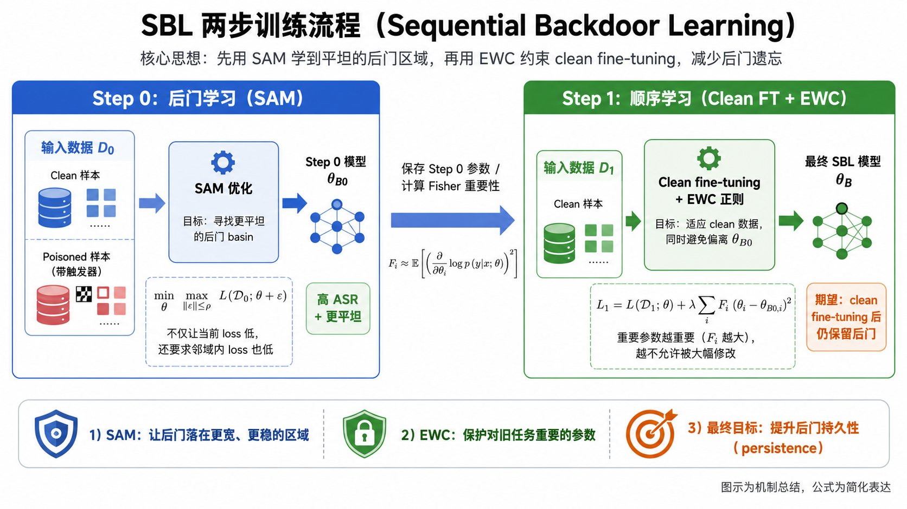

# SBL + BadNet on CIFAR-10: 前期验证实验报告

> 实验日期: 2026-05-04
> 实验环境: AutoDL RTX 4090 48GB, PyTorch 2.0.1+cu118
> 数据集: CIFAR-10 (50K train, 10K test)
> 模型: ResNet-18 (from scratch)
> 后门攻击: BadNet (3×3 白色 patch, 右下角), target_label=0, poison_rate=10%

#### **周工作汇总：**

我的思路是：先构建持久性后门baseline，然后实现防御方法，最后评估结果

- 完成对BadNet、BadCLIP、SBL方法的复现工作
- 对BadNet 和 SBL方法结合，测试BadNet的后门持久性
- 对结合后的方法使用FT方法进行防御，测试防御后持久性
- 对Landspace 可视化做了探索

## 1. 实验目的

验证 SBL (Sequential Backdoor Learning) 中 SAM (Sharpness-Aware Minimization) 训练是否能赋予标准 BadNet 后门**持久性** (persistence) —— 即后门在 clean fine-tuning 防御下仍然存活。



## 2. 实验设置

### 数据划分
| 数据集 | 样本数 | 用途 |
|--------|--------|------|
| D0 (Mixed) | 42,500 | 后门训练 (含 4,250 中毒样本) |
| D1 (Clean) | 5,000 | SBL Step 1 EWC 约束微调 |
| Defense | 2,500 | 防御方 clean fine-tuning |

### 方法对比

| 方法 | 训练方式 | 说明 |
|------|----------|------|
| **CBL** | 标准 SGD 训练 100ep | Conventional Backdoor Learning, 基线 |
| **SAM-only** | SAM 训练 100ep (rho=0.05) | SBL Step 0 only, 无 EWC 约束 |
| **SBL** | SAM 100ep → SAM+EWC 60ep | 完整 SBL 两步训练 |

### 防御设置
- Clean fine-tuning, SGD, lr=0.01, momentum=0.9, 50 epochs
- 仅使用 Defense 集 (2,500 样本)

## 3. 核心结果

### 3.1 数值结果 (defense lr=0.01, 强防御)

| Stage | CA (%) | ASR (%) |
|-------|--------|---------|
| CBL (训练后) | 92.40 | 99.91 |
| **CBL (防御后)** | **89.83** | **24.74** |
| SAM-only (训练后) | 93.05 | 99.92 |
| **SAM-only (防御后)** | **91.26** | **91.37** |
| SBL Step 0 (SAM) | 93.05 | 99.92 |
| SBL Step 1 (SAM+EWC) | 92.92 | 100.00 |
| **SBL (防御后)** | **68.86** | **15.26** |

### 3.2 防御过程 ASR 衰减轨迹 (defense lr=0.01)

| Epoch | CBL ASR | SAM-only ASR | SBL ASR |
|-------|---------|-------------|---------|
| 1 | 90.33 | 98.43 | 98.92 |
| 5 | **24.92** | 92.62 | 88.02 |
| 10 | 22.77 | **96.48** | 83.23 |
| 20 | 23.74 | 91.22 | 58.70 |
| 30 | 19.83 | 92.86 | 29.63 |
| 40 | 25.44 | 91.12 | 19.92 |
| 50 | 24.74 | **91.37** | 15.26 |

### 3.3 弱防御结果 (defense lr=0.005)

| Stage | CA (%) | ASR (%) |
|-------|--------|---------|
| CBL (防御后) | 91.11 | 95.37 |
| **SAM-only (防御后)** | **91.66** | **99.36** |
| SBL (防御后) | 80.77 | 82.21 |

## 4. 关键发现

### 发现 1: SAM 是持久性的核心机制

**SAM-only (无 EWC) 后门在强防御 (lr=0.01, 50ep) 下 ASR 仅从 99.92% 降至 91.37%**, 而 CBL 从 99.91% 暴降至 24.74%。这说明:

- SAM 训练将后门参数放置在 loss landscape 的**平坦区域** (flat minima)
- 即使强力 fine-tuning 也难以将参数推出该平坦区域
- SAM-only 在维持 CA 方面也表现最优 (91.26% vs CBL 89.83%)

### 发现 2: EWC Step 1 反而损害持久性

完整 SBL (SAM+EWC) 在防御后 ASR=15.26%, 甚至**低于** CBL 的 24.74%! 同时 CA 也严重退化 (68.86%)。分析原因:

1. **Fisher 信息量过小**: 原始 Fisher 均值仅 3×10⁻⁶, 即使归一化后 lambda=1.0 也可能不够
2. **EWC Step 1 的 clean fine-tuning 破坏了 SAM 建立的平坦 basin**: SAM Step 0 将后门放在宽广的平坦区域, 但 EWC Step 1 的梯度更新可能将参数推出该区域
3. **CA 退化说明模型被过度约束**: EWC 惩罚 + clean data 的交叉熵损失导致模型在两个目标间挣扎

### 发现 3: Loss Landscape 可视化确认 SAM 的效果

**线性插值 (Interpolation) 结果:**
- CBL: 从 backdoored → fine-tuned 路径上, ASR 从 99.91% 急剧下降至 24.74%
- SAM-only: 同路径上, ASR 从 99.92% 仅缓慢下降至 ~91%, **整个路径上 ASR 保持 >90%**
- Poison Loss: CBL 的 poison loss 沿路径急剧上升; SAM-only 保持平坦

**2D ASR Landscape (lr=0.005 实验):**
- CBL: 中心点周围 ASR 变化剧烈, landscape 崎岖, 有多个低 ASR 岛
- SAM Step 0: 高 ASR 区域更大、更连贯, landscape 更平坦

## 5. 对 Basin-Breaker 项目的启示

### 5.1 持久性后门 baseline 构建策略

基于实验结果, 建议的持久性后门构建路径:

1. **直接使用 SAM 替代标准优化器** 训练任何后门攻击 (BadNet, BadCLIP, WaNet 等)
2. **不需要 EWC Step 1** — EWC 在当前配置下反而有害
3. 核心超参: `rho=0.05` 对 ResNet-18/CIFAR-10 有效, CLIP 模型可能需要调整

### 5.2 SAM 赋能的一般性

SAM 是 optimizer-level 的修改, 可以直接替换任何后门攻击的优化器:
- BadNet + SAM → 持久性 BadNet
- BadCLIP + SAM → 持久性 BadCLIP (需要适配 AdamW → SAM(AdamW))
- WaNet + SAM → 持久性 WaNet

### 5.3 Basin-Breaker 防御需要应对的挑战

SAM-only 在 lr=0.01 防御下仍保持 91% ASR, 说明:
- 标准 clean fine-tuning 对 SAM 训练的后门**几乎无效**
- Basin-Breaker 需要设计更强的防御策略 (e.g., 主动跳出平坦区域)
- Loss landscape 分析是诊断持久性的有效工具

## 6. 后续实验计划

1. **扩展到 CLIP/CC3M**: 验证 SAM 赋能在多模态模型上的效果
2. **SAM rho 消融实验**: 测试 rho ∈ {0.01, 0.02, 0.05, 0.1, 0.2} 对持久性的影响
3. **更强防御测试**: NAD, i-BAU, SAM-FT 等非 fine-tuning 防御
4. **修复 EWC**: 调整 lambda (尝试 100~10000), 或改用 Anchoring 正则化
5. **多种后门触发器**: WaNet, Blend, SIG 等 + SAM 的持久性验证

## 7. 实验文件索引

```
/root/workspace/aaai-backdoor/baselines/badclip+sbl/
├── run_experiment.py          # v1 (有 bug: BN buffer 丢失, Fisher 未归一化)
├── run_experiment_v2.py       # v2 (修复版)
└── logs/
    ├── results_v2_*.json      # 结果 JSON
    ├── v2_interpolation_*.png # 线性插值图
    ├── v2_landscape_2d_*.png  # 2D ASR landscape (仅 lr=0.005 版)
    ├── v2_defense_trajectory_*.png  # 防御轨迹图
    └── v2_gradient_norms_*.png     # 梯度范数图
```

本地拷贝: `Basin-Breaker/pre-exp/sbl_exp_results/`

### **Fisher矩阵实现**

在 `compute_fisher()` 里计算。先创建一个和所有模型参数一样长的向量 `fish = torch.zeros_like(model.get_params())`，然后从 `d0_loader` 里最多取 2000 个样本。对每个样本，模型前向得到输出，算当前标签对应的 log probability，然后反向传播，拿到每个参数的梯度。最后把梯度平方累加到 `fish` 里：`fish += exp_cond_prob * model.get_grads() ** 2`。所有样本算完后除以样本数，得到平均梯度平方，也就是每个参数的重要性估计。
